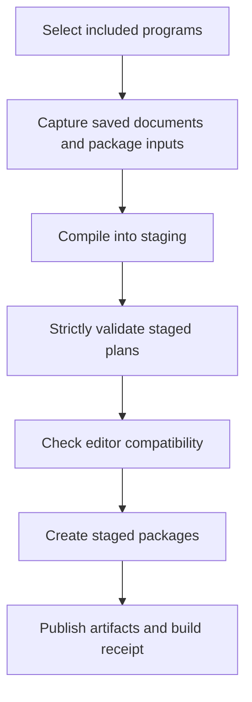

# HardwareTest Authoring Combined Implementation Plan

This plan combines the engineering authoring UI and UX review, the implementation roadmap, and the new test plan initialization requirements. It covers the complete authoring workflow: initialize a workspace and test plan, select hardware, define measurements and pass criteria, preview, save, check, and build deployment artifacts.

Deliver the work in five milestones and 22 work packages. Protect existing users first, establish durable draft and build contracts, then implement the new editor, release workflow, initialization, and expert controls. Each work package has implementation scope, dependencies, and an acceptance gate.

**Status:** Execution started on 2026-10-02. Traversal discovery, UI coverage, packaging protection, compiler persistence, and Save All/lifecycle have cleared independent review. Destructive-operation implementation passes Core, headless UI, architecture, and native Linux smoke checks; independent review is identifying final fixes for cleanup copy/read-only guards and stale whole-program confirmations. These six stacked slices deliver protection packages 01–04. GitHub integration write permissions currently block publication; nothing is merged. Packages 05–22, including new test-plan and workspace initialization, remain planned.

**Repository:** [josh-hemphill/dotnet-avalonia-hardwaretest-template](https://github.com/josh-hemphill/dotnet-avalonia-hardwaretest-template). The review baseline is commit `5f0d638`. During that review, the authoring app built with zero warnings and errors, all 295 authoring tests passed, and the running Linux interface was inspected at 1280×800 and 960×600. Those results are baseline evidence; new behavior will need its own verification.

**Execution base:** `1e8cf62` (PR #182), which replaces the solution with `dirs.proj` traversal builds. A prerequisite repair restores test and bootstrap repository discovery: upstream Windows/Linux CI still requires the deleted solution. Preserve traversal project/lockfile coverage. Packaging protection also verifies the authoring executable outside a checkout. Review criteria preserve historical numeric precision, empty-choice, implicit-sidecar, and rollback contracts; do not treat missing external TUI prerequisites as passing integration coverage.

## Delivery scope

Deliver all ten review findings: release integrity, draft safety, destructive-operation scope, editing layout, formula deployment clarity, criterion semantics, explicit instrument types, sequence operations, findings navigation, and responsive environment/build work.

Also deliver new test plan initialization, workspace creation from templates, guided onboarding, recordings import, full-board preview, keyboard commands, and useful layouts for wide monitors.

The operator remains a locked runner. Authoring Core remains Avalonia-free. Reuse shared operator presentation widgets, preserve unknown/raw steps, retain existing serialization meanings unless deliberately migrated, and keep the engineer's OpenTAP environment separate from the bench. Authoring does not execute hardware tests in its UI process.

Use focused services and child view models. Follow the repository's 600-line feature guidance when splitting the current large views and view-model files.

## Architecture and state contracts

### Saving and checking

The final application separates authoring source from generated deployable plans.

| State | Meaning |
| --- | --- |
| Edited | Changes exist in memory. |
| Saved | The authoring document is durable, including incomplete input. |
| Compiled | Deployable content generated TapPlans and sidecars. |
| Validated | Strict contract validation passed for the compiled revision. |
| Compatible | Required editor compatibility passed against the resolved package set. |
| Built | Deployment artifacts were produced from that checked revision. |

Save draft must retain incomplete fields and exploratory formulas. A saved document may still have build blockers. Editing invalidates current readiness while preserving the identity and receipt of previous successful artifacts.

Initially retain compiled Save program behavior while adding Save all and guards. Switch the normal save command to draft persistence after the storage contract and migration are complete. Keep compiled export available with explicit wording.

### Shared build pipeline

GUI and CLI use one service in `HardwareTest.Authoring.Core`:

Required checks execute against the content being packaged. A previous green UI badge is insufficient. Resolve authoring home overrides consistently. Inspect required compatibility prerequisites; unavailable coverage cannot be reported as a pass.

Capture a fingerprint of relevant documents, manifest, compiler/plugin versions, resolved package contents, declared plugin artifacts, and shell-app build inputs. Stage compilation and packaging, and publish a success receipt only after every required stage completes.

### Execution semantics

Two existing implementation details require engine work:

- `PlanCompiler.Save.cs` currently constructs only Mock DMM resources. Explicit instrument selection needs a resource-adapter model and typed bindings.

- `MeanGteStep` takes fresh instrument readings. It does not consume the previously selected acquisition waveform.

Preserve existing Mean GTE execution and label it accurately as a fresh-reading acquisition/check operation. Add a separate channel-based average check for the new workflow. New formula lowering, preview evaluation, and compiled execution must agree on which samples they consume, including repeated executions.

### Document editing

Introduce stable node IDs independent of display names and list positions. Preserve mappings to existing OpenTAP step IDs when available.

Use immutable snapshots or defensive deep copies. `ProgramSidecar` is mutable today; shallow record copies cannot reliably support Undo, snapshots, or independent drafts.

Keep authoring-only exploration in durable drafts. Clearly mark its exclusion from deployment. Unsupported expressions intended to run on the bench remain build blockers.

## Milestones and exit gates

| Milestone | Work packages | Exit gate |
| --- | --- | --- |
| 1 Protect current users | 01–04 | Packaging checks saved state and compatibility; navigation protects edits; destructive changes expose their scope. |
| 2 Establish document and build foundations | 05–10 | Incomplete work is durable, execution semantics are explicit, and artifacts come from identifiable saved snapshots. |
| 3 Deliver the focused editor | 11–16 | Common authoring tasks are spacious, discoverable, reversible, and repairable through the UI. |
| 4 Complete preview and release workflows | 17–18 | Engineers can explain both the preview data and the exact checked content of built packages. |
| 5 Deliver initialization and expert workflows | 19–22 | Engineers can initialize and complete new test plans through the app, with guided and keyboard workflows. |

Each work package should become a small PR or a short stack when it introduces contracts and consumers. Include behavior tests with the change. Do not delay packages 01–04 behind the redesign.

## Milestone 1 Protect current users

### 01 Authoring UI regression coverage

**Scope:** Create a dedicated authoring UI test project using Avalonia Headless. The existing E2E project initializes the operator application; keep the authoring lifecycle isolated. Provide fixtures for workspaces, preferences, file pickers, confirmation dialogs, and build services.

**Files:** New `tests/HardwareTest.Authoring.UI.Tests/`; solution/traversal configuration; `Directory.Packages.props`; `tools/ci/main.ts`; `.github/workflows/ci.yml`.

**Dependencies:** Existing application.

**Acceptance:** Tests can open the authoring window, edit a program, invoke a command, inspect focus, and verify dialogs without an engineer's real settings or hardware.

### 02 GUI and CLI packaging integrity

**Scope:** Reject GUI packaging while any workspace program has unsaved changes and identify affected programs. Make compatibility checking mandatory in production packing. Resolve selected environment overrides consistently. Show included and excluded programs before packing. Return structured strict-validation and compatibility failures.

**Files:** `AuthoringWorkspaceViewModel.cs`, `WorkspacePacker.cs`, `AuthoringCli.cs`, `WorkspacePackPlan.cs`, and `MainWindow.axaml.cs`.

**Dependencies:** 01 for UI regression coverage.

**Acceptance:** Editing a saved program or creating an unsaved one blocks Pack. Compatibility blockers reject both GUI and CLI packaging. Missing required compatibility prerequisites cannot report success. Failed preflight preserves previous successful artifacts.

### 03 Save all and workspace lifecycle protection

**Scope:** Expose per-program dirty markers. Add Save all with individual results. Guard workspace replacement, reopening, and window closing with Save all / Discard / Cancel. If saving fails, retain the current session and identify unsaved programs. Preserve selected program, selected step, and editing position after save.

Deliver 03 as two stacked slices: exception-safe compiler persistence first, then Save all and lifecycle UI. Prove rollback after TapPlan replacement and atomic sidecar-only saves with fault injection. Persistence can overlap packaging review because its files do not conflict; lifecycle waits for both reviews to clear. Crash recovery remains in 06.

**Files:** `AuthoringWorkspaceViewModel*.cs`, `MainWindow.axaml`, `MainWindow.axaml.cs`, and `App.axaml.cs`.

**Dependencies:** 01.

**Acceptance:** Saving one of two edited programs leaves the other visibly dirty. Cancelling navigation/close retains every edit. A failed save never silently completes the requested navigation.

### 04 Explicit destructive-operation scope

**Scope:** Separate program membership from workspace definition deletion. Show all affected programs before catalog deletion. Confirm catalog, instrument, and whole-program targets against a complete recursive content fingerprint and reject stale choices. Cleanup membership and policy setters must clone the selected sidecar, reject read-only edits, and retain the original draft consistently. Require an explicit compatible instrument replacement; list impacted identity, measurements, and cleanup, and block unresolved legacy bindings and raw/opaque references. Stage catalog additions/deletions and affected sidecars in memory; Save All commits global metadata after program saves succeed. Global-only metadata changes count as unsaved work. A failed final manifest replacement retains previous bytes and staged dirty state. Preserve untouched implicit arrays and remove implicit writes from editing.

**Files:** `AuthoringWorkspaceViewModel.CatalogDelete.cs`, `AuthoringInstrumentUsage.cs`, `ProgramSettingsView.axaml`, and related handlers/tests.

**Dependencies:** 01 and 03.

**Acceptance:** Removing a report from program A leaves program B unchanged. Catalog deletion exposes workspace-wide impact. Instrument removal never silently retargets acquisitions to the first remaining resource.

## Milestone 2 Establish document and build foundations

### 05 Document sessions and edit operations

**Scope:** Extract editing coordination from the large workspace view model. Introduce `AuthoringDocumentSession` for documents/revisions/selection; `AuthoringEditService` for explicit operations; `AuthoringHistory` for Undo/Redo and transactions; `AuthoringDependencyIndex` for references; and `AuthoringIssueService` for editing/compile issues.

Add stable node IDs, deep-copy guarantees, per-program history, and defined edit transaction boundaries. Include workspace definitions in the document/session save model. Expand isolated stale-impact mutation coverage for expression sources, transfer-function coefficients, limits, and history; test each change independently of other nested content.

**Files:** New focused Core services; `ProgramDraft.cs`; workspace view-model partials; relevant edit tests.

**Dependencies:** 03–04.

**Acceptance:** Rename, insertion, and deletion preserve unrelated IDs. Undo restores sidecars, bindings, limits, and cleanup. Switching programs retains independent selection and history. Dirty state reflects document content against its saved revision, including after Undo.

### 06 Versioned drafts and recovery

**Scope:** Add source-generated JSON DTOs with explicit discriminators. Persist stable IDs/order, sidecar settings, bindings, cleanup, incomplete numeric text, formula intent, raw XML, and baseline compiled revision. Do not serialize OpenTAP runtime objects. Extend protection-stack persistence tests with failure during rollback restoration: preserve a durable backup and the original error, and provide recoverable state when restoration itself fails. Current saves are exception-safe under successful restoration; they are not crash-safe multi-file transactions.

Proposed source storage: `authoring-drafts/<programId>.authoring.json` and `authoring-drafts/workspace.authoring.json`. Keep local recovery under `.authoring/recovery/`, staged builds under `.authoring/builds/`, and installed packages under `.authoring/opentap/`.

Implement temporary-write/replacement, interrupted-write recovery, future-schema read-only behavior, manifest migration/backups, and conflict handling for external TUI edits. Add debounced recovery checkpoints with visible failures. Distinguish successful Save from recovery checkpoints.

**Files:** New document DTOs/store/migration/recovery services; `AuthoringJsonContext.cs`; manifest schema, loader and version constants; gitignore/template conventions.

**Dependencies:** 05.

**Acceptance:** Missing thresholds and unsupported formulas save/reopen intact. Interrupted writes preserve the last good document. Future schemas are preserved. External compiled-file changes trigger reconciliation before export. Migration is idempotent and recoverable.

### 07 Criteria and runtime parity

**Scope:** Define recipe-specific criterion requirements independently of display role. Include units, inclusivity, and numeric constraints. Establish one authoritative representation of limits and resolve duplication between `LimitSpec` and source settings.

Add a channel-based average check to Basic plugins. Lower newly authored `mean(channel)` checks to it. Preserve legacy fresh-reading Mean GTE behavior. Scope capture to the intended producer execution/iteration; verify that derived operations cannot consume stale samples.

**Files:** `ProgramDraft.cs`; `FormulaLowerer.cs`; function catalog; compiler Save/Load; `MetricPreview.cs`; Basic steps and sample capture; package metadata/dependency pins.

**Dependencies:** 05.

**Acceptance:** Preview and the compiled channel-based check agree on average/verdict for the same series. Display changes do not hide or change criteria. Repeated runs/iterations use the correct samples. Existing Mean GTE plans retain execution behavior.

### 08 Typed instrument adapters

**Scope:** Replace compiler assumptions based on `HardwareDmm` with registered resource adapters. An adapter supplies type ID, display name, required package/availability, construction/serialization, address fields, compatible functions, and identity/shutdown capabilities.

Support declared, tested types. Installed types without an authoring adapter remain unavailable for creation and preserved when imported. Missing packages do not trigger mock substitution. Represent explicit algorithm instrument bindings and preserve actual imported legacy bindings, including a non-first instrument. The current compiler infers an instrument from ordering for legacy instrument-based algorithms; protection work blocks their removal while that binding remains unresolved. Add isolated stale-impact regressions for instrument metadata and cleanup policies as these bindings become explicit.

**Files:** Compiler Save/Load, function catalog, new instrument catalog/adapters, instrument-usage service, and package inspection/bootstrap services.

**Dependencies:** 05.

**Acceptance:** A scope never inherits a DMM type. Every supported resource round-trips with correct typed bindings. Missing packages and incompatible functions produce actionable issues. Imported unsupported content is preserved.

### 09 Build saved snapshots

**Scope:** Introduce build requests, immutable snapshots, compilation results/source maps, and build receipts. Include the relevant saved documents, manifest and package/build inputs in the fingerprint. Compile, validate, check compatibility, and package staged content.

Construct the exact artifact list from the snapshot. Publish final outputs after success. Preserve ship-manifest consumers through optional compatible metadata or a separate versioned receipt. Revalidate content/environment identity at publication boundaries, including resolved symlink dependency identity and containment within the selected home. Add a real installed external TUI process integration fixture; synthetic managed-payload and catalog/roundtrip tests establish prerequisites, not external integration.

**Files:** New shared build service/contracts; `WorkspacePacker.cs`; `WorkspacePackPlan.cs`; `AuthoringCli.cs`; compiler result/source mapping.

**Dependencies:** 06–08.

**Acceptance:** Edits or external file changes after capture cannot enter checked artifacts silently. Failure preserves the previous artifact set. Receipts identify included programs, source revision, dependencies, checks and output files.

### 10 Responsive operation orchestration

**Scope:** Coordinate bootstrap, compilation, validation, compatibility and packaging. Serialize OpenTAP-sensitive operations; dispatch UI updates correctly. Expose stages/progress/logs/results, block duplicate starts, define cancellation boundaries, stop child processes safely, and clean staging.

Prefer child-process isolation for package-dependent OpenTAP work through the authoring executable's headless infrastructure. Define versioned request/result handling and keep logs distinct from structured results. Retain the architecture boundary against the operator worker.

**Files:** New operation coordinator/process runner; authoring command dispatch; build/bootstrap/compatibility orchestration; busy state and progress contracts.

**Dependencies:** 09.

**Acceptance:** Deliberately slow work leaves the UI responsive. Cancelled work cannot publish success. Late results cannot update another workspace's state. Duplicate starts are blocked, failures leave actionable logs, and plugin environments cannot contaminate later workspace operations.

## Milestone 3 Deliver the focused editor

### 11 Responsive main shell

**Scope:** Use a compact command bar, Programs rail with dirty markers, sequence plus flexible editor, and explicit Hardware, Preview, Issues, Environment and Build views. Preview is separate at narrow widths and may dock on wider screens when adequate editor width remains.

Extract focused views; preserve selection/focus/scroll restoration. Use stacked fields when space or scaling requires it. Extend the headless UI foundation with visible, nonzero, in-window bounds for the sequence, inspector, and preview at supported sizes and scaling. Replace the protection modal's fixed header/footer allowance with measured rows before supporting larger fonts or localized text, keeping decision controls visible. Existing coverage proves command feedback, many-program scrolling, and safe modal choices.

**Files:** `MainWindow.axaml` and handlers; new focused views/child view models; layout preferences.

**Dependencies:** 05.

**Acceptance:** At 960×600 and 1280×800, instrument, measurement, sampling and required criteria are usable without horizontal scrolling. Scaling and long labels do not clip controls. Focus stays visible.

### 12 Selected-step forms

**Scope:** Organize Configure / Operator display / Advanced. Configure holds source, instrument/input, settings and criteria; Operator display holds friendly visualization names/unit/preview; Advanced holds stable channel ID/history/implementation detail.

Provide distinct forms for identity, prompts/input, repeats, cleanup and raw steps. Use appropriate numeric controls, retain incomplete input, and render fields required by the actual recipe. Operations that need an instrument retain an explicit instrument binding.

**Files:** New step editor views/child view models; `AuthoringWorkspaceViewModel.Editor.cs`; relevant ProgramSettings logic and copy catalogs.

**Dependencies:** 07 and 11.

**Acceptance:** Display changes preserve criteria. Setup/cleanup omit irrelevant metric fields. Invalid fields expose visible, accessible explanations. Changing a recipe validates or migrates its settings explicitly.

### 13 Formula deployment status

**Scope:** Prominently classify expressions as Deployable recipe, Preview only, Invalid expression, or Missing deployment requirements. Separate exploration from deployable checks in the palette; show lowering target and input/time-grid requirements.

Exploration persists in drafts with explicit deployment exclusion. Unsupported expressions marked for deployment block the build. Offer supported alternatives when an equivalent actually exists.

**Files:** Formula lowerer/outcome model, formula editor, recipe metadata, document formula intent, and issue projections.

**Dependencies:** 06–07 and 12.

**Acceptance:** `std(channel)` saves for exploration without being presented as deployable. Missing mean thresholds navigate to the requirement. Filter preview/build report irregular or missing time data consistently.

### 14 Hardware and workspace definitions

**Scope:** Build a hardware table with logical name, actual type, address, package status, usage and cleanup coverage. Add/edit uses registered adapters; removal/replacement uses dependency impact.

Move definition administration to workspace management. Keep per-program membership distinct. Apply changes through document transactions and the common save/undo model.

**Files:** New Hardware and Workspace definitions views, catalog/instrument child view models, adapter and usage services.

**Dependencies:** 04, 08 and 11.

**Acceptance:** Engineers can identify types and affected steps without XML. Workspace-wide changes show impact and preserve unrelated program membership. Saved/reopened bindings match the visible selection.

### 15 Sequence operations

**Scope:** Create a searchable palette organized as Measure, Check, Operator action and Flow. Show prerequisites and compatibility before insertion. Add at an explicit insertion point; repeat names the selected eligible target. Remove generated Test Group from insertion choices.

Add Rename, Duplicate, Move up/down and Undo/Redo. Label special actions Remove loop, keep steps and Disable safe shutdown. Allocate new IDs/unique output channels on duplication, rewrite internal subtree references, and retain intended external references. Validate ordering and loop scope before reordering; treat opaque steps conservatively.

**Files:** Recipe catalog/palette, sequence operations/dependency index, sequence view, edit history and compiler mappings.

**Dependencies:** 05, 07–08 and 12.

**Acceptance:** Repeat targets the selected measurement. Duplication cannot create duplicate output IDs. Invalid movement names the dependency and leaves content unchanged. Undo restores the complete previous document.

### 16 Actionable findings

**Scope:** Add optional structured targets for program, stable node/compiled step, field and settings section. Generate compiler source mappings and retain plan-wide targets when no reliable field exists. Do not infer targets from free-text messages.

Create Issues counts/severity/revision/staleness and Go to field. Replace duplicated dirty-validation messages with one actionable explanation. Maintain text/JSON/SARIF compatibility.

**Files:** `AuthoringFindingRow.cs`; compiler source maps; relevant `PlanContractFinding` producers/formatters; Issues view and navigation services.

**Dependencies:** 09 and 11–12.

**Acceptance:** Missing threshold opens the right program/step/section and focuses the field. Plan-wide findings open appropriate settings. Editing invalidates prior checked state. Unsupported targets never pretend to resolve.

## Milestone 4 Complete preview and release workflows

### 17 Board preview and recordings

**Scope:** Show acquisitions and derived criteria together using shared gauge/chart/timing widgets. Put data-source selection above the board. Distinguish example data from recordings; show provenance, DUT, channels, sample count and time-base availability.

Add recording import/open-folder actions and useful empty states. Validate schema/channel availability, preserve elapsed time, handle conflicting import destinations, and retain prior selection on failure. Reuse `RunDatasetCatalog`, `RunDatasetBinder`, and existing evaluators.

**Files:** `OperatorPreviewPane.cs`; new board preview/data-source views; dataset catalog/import services; preview builders and evaluators.

**Dependencies:** 07 and 11–13.

**Acceptance:** Valid imports refresh recordings. Invalid data preserves the previous selection. Missing channels and invalid time grids identify affected calculations. Preview uses the runtime semantics established in 07 and never claims hardware execution.

### 18 Environment and Build views

**Scope:** Environment shows required/installed packages, missing versions, selected home, and offline import/preparation paths. Rename Bootstrap to Prepare authoring environment and show actual prerequisites.

Build shows included/excluded programs, saved revision, compile/strict-validation/compatibility/dependency states, package/version/output, staged progress/logs, and completed receipt. Editing invalidates current readiness while retaining previous artifact history. Add a successful GUI packaging test proving the rendered selected home, excluded plans, and retained results; current protection coverage proves GUI dirty rejection and core/native packaging.

**Files:** Environment/Build views and child view models; shared build/operation services; pack preview; package inspector/import; preferences/environment resolution.

**Dependencies:** 09–10 and 16.

**Acceptance:** Missing packages expose a supported recovery path. Compatibility reports passed only after the real checker completes. Artifacts identify the checked revision. Preparing/building does not imply bench installation. Cancellation/error leave previous successful results intact.

## Milestone 5 Deliver initialization and expert workflows

### 19 New test plan initialization

**Scope:** Make New test plan available from the Programs rail and command palette. One Core initialization service supports guided creation, templates and future CLI use.

The flow creates a durable authoring draft; compilation and deployment artifact generation use the shared build pipeline. Give the new document its own stable plan/node/channel IDs and normal dirty, save, undo and issue behavior.

**Initialization flow**

1. **Name and destination:** Enter display name/device family. Generate an editable stable plan ID. Show workspace and draft filename. Reject duplicate IDs, case-equivalent file collisions where applicable, invalid names, and paths outside the workspace.

2. **Starting point:** Choose an empty plan or a supported task template. Clearly identify demo templates and mock instruments.

3. **Hardware:** Reuse logical resources or create explicitly typed ones. Show package readiness and compatible functions. Preserve incomplete initialization as a draft when dependencies are missing.

4. **Setup and cleanup:** Configure DUT identity and required operator fields. Optionally add fixture confirmation/input. Show proposed shutdown coverage and behavior for selected measurements. Missing requirements remain visible draft issues.

5. **First measurement and criterion:** Optionally configure source, output channel, unit, sampling and pass criterion. Generate unique IDs and allow incomplete measurement settings.

6. **Review and create:** Summarize sequence, instruments, requirements and destination files. Save the draft and open it with useful selection, outstanding issues and the next action. Generate TapPlan/sidecar through explicit compile/check operations.

**Implementation:** Add `AuthoringPlanInitializer`, `PlanInitializationRequest`, and `PlanInitializationResult` in Core. Reuse the document store, instrument adapters, recipe definitions, criteria and dependency services. Route existing `CreateProgram()` through this service.

Validate destinations before writing. Publish the created draft atomically, allocate unique identity safely, and detect external file changes/collisions again at commit. Cancellation before completion leaves no initialized plan files. If no hardware/measurement is chosen, persist an empty draft with requirements to complete before deployment.

**Files:** New initializer/contracts; document store and recipe catalog; new initialization views; Programs rail/command integration; initialization tests.

**Dependencies:** 05–08 and 11–14. Integrate preview after 17.

**Acceptance:** Initialization assigns unique plan, node and output IDs; product creation never silently inserts mocks; setup/cleanup matches chosen resources; incomplete plans save/reopen intact; collisions cannot overwrite existing plans; cancellation/interrupted writes cannot leave a partial plan. Opening the created plan shows meaningful selection/issues. A completed supported template compiles, validates and passes compatibility.

### 20 Workspace creation and templates

**Scope:** Add Create workspace from template alongside Open existing and recent workspaces. Make template metadata explicit: supported task, required packages, generated draft/manifest contents and demo/product classification.

Ask for destination, workspace/package identity and required settings. Show files before creation. Protect existing content, create consistent directories/schemas/ignore conventions, and recover or remove only files created by the failed operation.

Workspace creation can continue into 19 without requiring engineers to edit manifests or sidecars.

**Files:** Workspace initializer/template descriptors; `AuthoringWorkspaceLoader.cs`; manifest/schema templates; welcome/creation views and tests.

**Dependencies:** 06, 08, 11 and 19.

**Acceptance:** Empty workspace creation and creation from a task template are reproducible. Conflicts never overwrite unrelated files. Cancellation/failure does not leave an apparently complete but invalid workspace. New workspaces can immediately save/open a test-plan draft.

### 21 Guided onboarding

**Scope:** Compose the services from 19–20 into a guided first-success flow: name/device → instrument → measurement → criterion → preview → save/check. Offer common task templates and a direct empty-plan route.

Show generated identity and cleanup transparently. Keep experts able to skip optional guidance. Missing packages or deployment requirements offer recoverable actions. Use task language instead of requiring knowledge of sidecars, mixins or Mean GTE identifiers.

**Files:** Onboarding views/coordinator; template descriptions; contextual help and creation navigation.

**Dependencies:** 12–14, 17 and 19–20.

**Acceptance:** A first-time engineer initializes, saves, reopens and completes a voltage test through the app. The guided and direct paths produce equivalent documents. Leaving guidance retains entered draft content, and blockers explain the next action.

### 22 Expert commands and saved layouts

**Scope:** Add a searchable command palette and platform-appropriate Save/Save all, Undo/Redo, Rename, Duplicate, Add step, movement and next-issue shortcuts. Preserve normal text editing shortcuts. Verify native folder-picker focus and operating-system close decisions on Windows and Linux alongside headless interaction tests. Recheck owner and workspace session after asynchronous custom lifecycle chooser results; cover pending Save All/Discard choices when the owner is hidden or the session changes. Actual modal hiding currently cancels safely.

Support a collapsible Programs rail, wide-screen preview docking, Issues drawer, selected-node dependency summary, remembered layout/reset, and future-schema-safe preference migration. Document the TUI escape hatch; launch support must verify prerequisites and handle externally changed plans through the reconciliation model.

**Files:** Command catalog/palette and shortcuts; shell layout preferences; `AuthoringPreferences.cs` and store/migration; dependency summary; optional TUI launcher.

**Dependencies:** 11 and 15–18. Expose initialization commands from 19–20.

**Acceptance:** Keyboard users complete common authoring and new-plan creation workflows. Commands explain prerequisites. Restored layouts work on smaller screens. Preferences remain workstation-local; TUI return does not silently overwrite drafts.

## Dependency and merge order

| Work | Dependencies |
| --- | --- |
| 01 UI test foundation | Existing app |
| 02 Packaging protection | 01 |
| 03 Save all and lifecycle | 01 |
| 04 Destructive scope | 01, 03 |
| 05 Document sessions | 03–04 |
| 06 Draft persistence | 05 |
| 07 Criteria and runtime parity | 05 |
| 08 Instrument adapters | 05 |
| 09 Snapshot build pipeline | 06–08 |
| 10 Operation orchestration | 09 |
| 11 Responsive shell | 05 |
| 12 Step forms | 07, 11 |
| 13 Formula status | 06–07, 12 |
| 14 Hardware and catalogs | 04, 08, 11 |
| 15 Sequence editing | 05, 07–08, 12 |
| 16 Findings navigation | 09, 11–12 |
| 17 Preview and recordings | 07, 11–13 |
| 18 Environment and Build | 09–10, 16 |
| 19 Test plan initialization | 05–08, 11–14; preview integration after 17 |
| 20 Workspace creation | 06, 08, 11, 19 |
| 21 Guided onboarding | 12–14, 17, 19–20 |
| 22 Expert workflows | 11, 15–18; initialization commands after 19–20 |

After package 05 freezes document/editing contracts, runtime/catalog and interface work can proceed as separate implementation streams. Merge consumers after their required contracts.

Coordinate shared changes to `ProgramDraft`, compiler source mappings, serialization/schema versions, and shell navigation. Avoid simultaneous broad rewrites of the workspace coordinator and main window. Preserve the existing tests while introducing replacement services incrementally.

## Review finding coverage

| Review finding | Delivery packages |
| --- | --- |
| Release readiness must match shipped state | 02, 09–10, 18 |
| Protect drafts and unify saving | 03, 05–06, 11, 22 |
| Expose cross-program destructive scope | 04–05, 14 |
| Give editing forms useful space | 11–12, 22 |
| Distinguish previewable and deployable formulas | 06–07, 13, 17–18 |
| Separate criteria from display choices | 07, 12 |
| Make instrument types explicit | 08, 14, 19 |
| Match sequence operations to selected targets | 05, 15, 22 |
| Turn findings into a repair workflow | 09, 16 |
| Provide responsive environment and build recovery | 10, 18 |

New test plan initialization is covered explicitly by 19. Workspace creation and guided onboarding are 20–21. Board preview, recording import and expert layouts are 17 and 22.

## Migration and compatibility

| Area | Required behavior |
| --- | --- |
| Existing workspaces | Import compiled files into drafts while preserving original execution behavior. |
| Manifest | Version draft configuration deliberately; preserve backups and future-schema protections. |
| Draft schema | Preserve incomplete fields, stable IDs, exploratory intent and raw XML. |
| Existing Mean GTE | Retain fresh-reading behavior; add a separate channel-based operation. |
| Basic plugin package | Version new runtime steps and update required dependency pins. |
| Operator sidecars | Preserve tokens/schema unless an explicit runtime requirement needs migration. |
| Ship manifest | Preserve consumers through compatible optional metadata or a separate versioned receipt. |
| Preferences | Migrate layout settings and provide reset. |
| External TUI edits | Detect conflicting compiled-file changes and reconcile before export. |
| New initialization | Use current schemas/templates and never overwrite colliding plans or unrelated workspace files. |

Run migration explicitly with recoverable original files. Repeating a completed migration should leave content unchanged. Failure preserves the original documents and deployable plans.

Define deployment inclusion separately from draft storage. Show included/excluded programs and exploratory content before build. Unsaved workspace edits remain explicit blockers in the GUI; saved incomplete content intended for deployment blocks compilation.

## Verification and release gates

### Automated behavior coverage

Use the existing Authoring suite for documents, compiler, CLI and packing. Add focused tests for multi-program saves/failures; lifecycle cancellation; catalog impact/replacement; draft migration/recovery; Undo with mutable sidecars; reference-safe duplication/reordering/repeats; preview/runtime parity; typed resources; snapshot consistency; staged publication; and GUI/CLI check parity.

The dedicated authoring UI suite covers bindings, focus, dialog results, commands, issue navigation and layout. Include initialization tests for empty/template-based plans, unique IDs, missing packages, read-only workspaces, collisions, invalid paths, cancellation, interrupted writes, save/reopen and successful compile/check/build.

Run compatibility integration against supplied real TUI packages. Missing prerequisites are unavailable integration coverage, not passes. Keep architecture checks and run host/worker regressions when plugin execution changes. Respect process-global OpenTAP test serialization.

### Desktop acceptance

Verify 960×600, 1280×800 and wide layouts; light/dark themes; 100%, 150% and 200% scaling; long names; keyboard focus/traversal; screen-reader labels/status; empty/populated/invalid/read-only/future-schema workspaces; missing packages/offline preparation; cancellation and failures.

Verify Windows and Linux. Verify macOS before claiming authoring support there. Rendered checks complement headless tests, particularly for charts, scaling, focus and real dialog integration.

### Engineer usability validation

Run formative sessions with approximately five or six engineers across new and experienced users. Observe:

1. Initialize a new workspace/test plan, select an instrument and save an incomplete draft.

2. Complete a voltage acquisition and average-threshold check, then reopen it.

3. Change visualization without changing the criterion and explain the preview source.

4. Explore an unsupported formula and distinguish exploration from deployment.

5. Edit two plans, save one, cancel workspace replacement and recover the remaining work.

6. Add a scope, identify compatible recipes and replace a referenced resource.

7. Repair a multi-program finding and identify the exact revision/checks in the built artifact.

Measure completion, assistance, mistaken scope, recovery and interpretation of readiness. Set speed/discoverability targets after measuring the current baseline.

Release gates require no silent draft loss, no unannounced cross-program mutation, no artifacts from inconsistent or unchecked revisions, no implicit instrument substitution, and clear differentiation of exploration and deployment.

## Documentation and completion

Update `docs/getting-started.md`, `docs/authoring-app.md`, `docs/adapting.md`, `docs/testing.md`, and the relevant README/schema/template guidance as each behavior ships. Explain migration, draft saving versus compilation, resource types, new-plan creation, recording import, checks, artifact receipts and keyboard workflows. Treat earlier UI remediation plans as historical work; do not present merged fixes as new deliverables.

The combined delivery is complete when:

- [ ] All ten review findings have implemented acceptance coverage.

- [ ] Incomplete drafts save, reopen and recover.

- [ ] Existing plans retain execution behavior through migration.

- [ ] New channel-based checks and previews agree.

- [ ] Supported instruments have explicit types and compatible functions.

- [ ] Sequence editing is reversible and respects dependencies.

- [ ] Findings navigate to reliable targets.

- [ ] GUI and CLI use the same required build checks.

- [ ] Artifacts identify their checked content and dependencies.

- [ ] Engineers can initialize, save, reopen, complete, validate and package a new test plan entirely through the application.

- [ ] Workspace/template creation protects existing files and handles cancellation/failure.

- [ ] Guided and direct initialization produce equivalent documents.

- [ ] Keyboard, accessibility and desktop acceptance checks pass.

- [ ] Engineer sessions verify the intended workflows.

- [ ] Documentation describes the delivered behavior.

Start implementation with packages 01–04. Assign owners and refine effort estimates when work is scheduled; this plan establishes scope, dependencies and acceptance gates without assuming staffing or calendar dates.

## Repository references

The plan is grounded in the reviewed repository and its existing architecture/test contracts:

- [Authoring architecture](https://github.com/josh-hemphill/dotnet-avalonia-hardwaretest-template/blob/5f0d638f406929e013090eb71a54dded6d1f2a05/docs/authoring-app.md)

- [Getting started](https://github.com/josh-hemphill/dotnet-avalonia-hardwaretest-template/blob/5f0d638f406929e013090eb71a54dded6d1f2a05/docs/getting-started.md)

- [Testing guidance](https://github.com/josh-hemphill/dotnet-avalonia-hardwaretest-template/blob/5f0d638f406929e013090eb71a54dded6d1f2a05/docs/testing.md)

- [Compiler resource construction and bindings](https://github.com/josh-hemphill/dotnet-avalonia-hardwaretest-template/blob/5f0d638f406929e013090eb71a54dded6d1f2a05/src/HardwareTest.Authoring.Core/PlanCompiler.Save.cs)

- [Mean GTE execution](https://github.com/josh-hemphill/dotnet-avalonia-hardwaretest-template/blob/5f0d638f406929e013090eb71a54dded6d1f2a05/src/HardwareTest.OpenTap.Plugins.Basic/Steps.cs#L119)

- [Draft model](https://github.com/josh-hemphill/dotnet-avalonia-hardwaretest-template/blob/5f0d638f406929e013090eb71a54dded6d1f2a05/src/HardwareTest.Authoring.Core/ProgramDraft.cs)

- [Workspace packing](https://github.com/josh-hemphill/dotnet-avalonia-hardwaretest-template/blob/5f0d638f406929e013090eb71a54dded6d1f2a05/src/HardwareTest.Authoring.Core/WorkspacePacker.cs)

New service names, storage paths, work packages and acceptance gates are proposed implementation choices. The review baseline does not establish coverage for the future changes.

Branch-level contracts and the conflict map are in [authoring-protection-stack.md](authoring-protection-stack.md).
