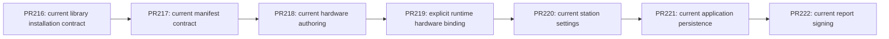

# Authoring without legacy application paths

## Goal

The application has not been deployed or used. Keep one current authoring design and current persisted manifest contract. Remove application backward-compatibility paths instead of maintaining old application data or parallel hardware creation designs. Preserve useful OpenTAP import, external package, runtime broker, containment, corruption, and save-failure behavior where it serves the current product.

The stack is:



## Area 1: current manifest contract — PR217

### Specification

`authoring.json` must use current manifest schema 2 for editing or saving. A lower version is rejected before creating a directory, temporary file, backup, package, or replacement. A future manifest can still load read-only; saving over its existing bytes is rejected. Saving a current request over an existing older manifest is also rejected.

The manifest nested inside `authoring-drafts/workspace.authoring.json` follows the same version contract. Unsupported older nested manifests are reported as recoverable, read-only source corruption; their bytes cannot be silently replaced. Future nested manifests remain read-only. Remove manifest migration, the `--migrate` command, schema-specific migration backups, and migration-based catalog comparison normalization.

The shared workspace, its manifest schema, manual compiled-workspace fixtures, and current test manifests use schema 2. Other document formats have independent current versions; run records currently use version 4. Do not renumber those formats as part of this area. Ordinary atomic-save backups remain.

### Pseudocode

```text
load manifest:
    parse required positive integer version
    if version < current: reject without writes
    if version > current: load read-only
    otherwise: validate current fields and load

save manifest:
    validate destination containment
    if destination exists:
        load existing manifest
        reject older or read-only future manifest
    require request.version == current
    create destination and atomically write current content

load nested workspace manifest:
    reject version < current as recoverable read-only source
    treat version > current as read-only
    otherwise permit current source edits

save nested workspace manifest:
    require request.version == current
    reject an existing read-only source
    use ordinary atomic writer and backup
```

### Tests

Replace migration-success cases with actual byte-preservation checks for older manifest load/save, saving over older existing bytes, and an invalid old request targeting an absent directory. Keep current-schema round trips, atomic replacement failure cleanup, future existing-manifest protection, nested-source recovery, and normal backup preservation.

Exercise removed `--migrate` as an invalid command for older/current/future files, preserving the files and creating no artifacts. Verify bootstrap, validation, pack, and compatibility commands reject an old manifest before writing. Verify an older nested manifest blocks export without being normalized into a current catalog.

Update current inline manifest fixtures and shared-template callers. Future-schema tests that replace the shared template's version literal must now replace 2 with 999 so they still exercise their intended protection.

### Risks and conflicts

Old developer fixtures will stop opening. Update maintained fixtures explicitly; do not add an automatic upgrade path. Do not blanket-replace schema 1 in unrelated documents. Version rejection must precede directory creation. Keep future existing-file protection even when the incoming request uses schema 2.

The shared `plans/opentap/authoring.json` fixture is copied by many core and UI tests; its version change affects future-schema replacement tests and manual review data. Run those tests alongside manifest tests. PR216 changes bootstrap tests and package handling, so keep this area based on the completed PR216 stack and limit bootstrap test changes to manifest literals.

## Area 2: current hardware authoring — PR218

### Specification

Remove old VISA DMM from the authoring catalog, New test plan hardware choices, binding creation, and old-VISA-specific authoring validation. Remove `WorkspaceCreationRequest.IncludeVisaPackage` and the host's authoring construct/serialize adapter helper. Rename the remaining built-in adapter collection to Demo, and rename `ProductVoltage` to `HardwareScaffold` without an alias. Physical library adapters expose generic identity and safe shutdown; voltage/mean recipes remain explicit Mock DMM demonstrations. Retain modern Instrument Components adapters and explicit Mock DMM demo support.

Remove unused VM `CreateProgram` convenience overloads. Production UI already uses durable `InitializePlan`; migrate test setup to that path with explicit instruments. Tests requiring unsaved changes should make a real edit after durable initialization.

Retain required runtime broker infrastructure. Remove authoring bootstrap's old VISA package installation route alongside its authoring adapter. The following runtime area removes the obsolete plugin; the modern bridge uses IVisaBroker directly and does not require VisaBrokerHost.

Remove the three unreviewed catalog deletion wrappers and their rejection helper. All deletion requests use Prepare/Review/Apply; retain blank-target diagnostics, protected catalog entries, durable source and stale-review guards.

Runtime bootstrap may return early only when the full declared OpenTAP runtime payload validates. Continue rejecting present invalid files before copying, allow missing declared files to be repaired, and permit unrelated partial external imports without a current-library requirement.

### Pseudocode

```text
hardware choices:
    discover validated current library adapters
    append explicit Mock DMM demo choice
    offer no old VISA DMM creation route

create plan:
    review explicit request
    initialize durable current authoring source
    present its normal document session

bootstrap authoring runtime:
    reject present invalid runtime payload
    return early only when full declared payload validates
    otherwise copy missing current runtime files
    install explicit Mock/current library packages; exclude old VISA authoring package

delete catalog entry:
    prepare current request -> review -> apply with source/staleness/protected guards
```

### Tests

Convert old-VISA authoring acceptance to unavailable-adapter coverage. Retain actual slot binding, no substitution, stable node identity, opaque source preservation, stale destructive-review detection, and cleanup retargeting tests using explicit Mock slots or modern library devices as appropriate.

Port payload completeness, symlink containment, cyclic-link, and ancestor-resolution coverage to current adapter/package fixtures instead of deleting those regressions. Keep runtime `VisaDmmInstrumentTests`, plan validation, and broker coverage until the separate runtime scope assessment establishes their replacement.

Update hardware UI fixtures in `AuthoringHardwareDefinitionTests`, `AuthoringGuidedRecoveryTests`, `AuthoringWorkspaceCreationUiTests`, `AuthoringPlanInitializationTests`, `AuthoringGuidedOnboardingTests`, and `AuthoringExpertCommandsTests`. Use Mock DMM for demo voltage/mean behavior and library hardware scaffolds for physical-device lifecycle behavior. Update both test projects' initialization helpers and direct callers of the removed VM conveniences. Preserve unsaved test semantics by making real edits after initialization. Port catalog deletion wrapper tests to reviewed requests. Add regression coverage that prepares a current Mock home, deletes a genuine declared runtime dependency, and verifies a second prepare repairs its bytes; retain unrelated no-library partial-import acceptance.

### Risks and conflicts

Modern library devices currently do not support the old authoring voltage/mean recipes. Removing the old physical DMM authoring path does not make the library equivalent; preserve explicit demo measurement coverage and accurately describe physical scaffold limitations.

Removing the authoring helper without addressing bootstrap's Type marker breaks compilation. Removing the entire VISA plugin at the same time would broaden this area into runtime behavior; assess that independently. Do not delete document/session dirty tracking merely because a comment describes compatibility: current saving, recovery, and history still use it.

PR218 must build on PR217's schema-2 fixtures. Keep shared initialization test-helper updates coordinated so current hardware regression coverage survives the removal of old convenience APIs.

## Area 3: explicit runtime hardware binding — PR219

### Specification and public surface

Remove the entire obsolete HardwareTest.OpenTap.Plugins.Visa project, VisaDmmInstrument, VisaBrokerHost, package metadata, project registrations and lockfile. Retain IVisaBroker, worker hardware ownership, the owned current Instrument Components execution library and InstrumentComponentsScpiIo provider, and the owned StandaloneVisa distribution boundary. Authoring searches use Basic and Mixins without obsolete DLL filters or no-Visa guards.

Replace includeVisaAdapter and ExcludeVisaAdapter with EnablePhysicalExecution (false by default), independent of plugin inclusion. Production OpenTapSession and worker execution explicitly enable it. Catalog, authoring, validation and demo searches default to false. Only enabled execution with a broker loads the owned execution library and registers its current provider; no broker means no execution-library/provider loading. Preserve approved-byte loading, provenance, all-root prevalidation and rejection before provider mutation. The published library parses its embedded model registry with reflection JSON; explicitly enable that runtime capability in the untrimmed worker and owned standalone execution processes and their execution fixtures. Application persistence retains source-generated contexts. Authoring and validation processes do not execute physical instruments.

Remove TryRebindDmmResource from station/session APIs, worker messages, implementations, fakes and approved public surfaces. TryBindSlotResource requires an existing named slot and its exact instrument; blank slot/resource or unknown slot returns false without mutation. Rename StationProfile.RoleToResource and its worker DTO to SlotToResource without an API or wire alias. ApplyStationAndDut and run snapshots match only exact current slot names (ordinal case-insensitive), never RoleHint, dmm or first instrument.

BuildStationProfile emits only explicit PlanSlotOverrides.SlotName entries. Existing registry storage removal belongs to PR220, but runtime cannot consult it. RoleHint remains display metadata. The debug overlay requires an explicitly selected existing slot beside the Resource input. Missing or unknown selection and blank resources produce actionable status before any step/resource mutation; preserve threshold, acquisition and enabled patch features.

### Pseudocode

```text
search(enablePhysicalExecution = false, broker):
    if enablePhysicalExecution and broker exists:
        prevalidate and load owned current library
    search Basic, Mixins and configured roots
    if enablePhysicalExecution and broker exists: bind current SCPI provider

bind(slotName, resource):
    reject blank name/resource
    find exact known slot and exact corresponding instrument
    reject absent slot/instrument without mutation
    set supported resource property and update only that slot

apply station:
    for each known slot:
        apply only SlotToResource[slot.Name]

debug patch:
    require selected existing slot and nonblank resource before mutations
    bind selected slot; apply existing enabled/acquire/threshold controls
```

### Tests

Use an actual two-Mock-instrument plan to verify a selected slot changes only its instrument, unknown/blank requests change neither, and a broad DMM role cannot override explicit resources. Verify worker DTO and dispatch parity and current protocol approvals. Cover debug selection errors before mutations and retained patch controls, and exact profile/snapshot behavior.

Port old DMM broker query/write, timeout clamping, disposal and invalid-resource coverage onto the genuine published library and current SCPI bridge. Physical plan validation uses a genuine current library instrument; retain Mock measurement validation. Keep cold owned execution loading, invalid root/prevalidation, worker broker ownership and StandaloneVisa boundaries. Use fake brokers only; never perform hardware I/O.

### Risks and conflicts

Runtime entrypoints must opt in explicitly so changing defaults does not disable production physical execution. Wire and public mapping names change together with no old aliases. Removing a plugin reference changes affected restore graphs; remove its lockfile and regenerate retained project locks through restore, never by manual fabrication. Settings registry and idle-hour cleanup are out of scope until PR220. Preserve the upstream TUI readiness classifier and owned-load contract unchanged.

## Area 4: current station settings and authoring surfaces — PR220

- Goal: current per-plan slot overrides and idle minutes are the sole station settings model; authoring and bench presentation expose only used current operations.
- Depends on: reviewed PR219.
- Out of scope: Area 5 persisted schema gates/run ledgers, Area 6 report signing, external OpenTAP interchange, broker execution.
- Files: AppSettings, SettingsStore, settings binder/provenance/copy/JSON metadata, station/operator/settings VMs, authoring workspace/catalog/initializer tests, LivePresentationViewModel, OperatorTouchDensity, BuildInfo and corresponding test projects.
- Public surface: remove Instruments/StationBindings/VisaInstrument/StationBinding, dormant global DefaultVisaResource and OperatorSessionIdleHours; retain PlanSlotOverrides, current minute normalization and editing-time MigrateSettings. Remove unused discovered aliases. Rename OpenTapPluginDirectoriesEnv to match HARDWARETEST_OPEN_TAP_PLUGIN_DIRECTORIES everywhere, with no old-name alias. NormalizeBooleanInput retains supported 1/yes/on syntax.
- Authoring surface: remove unused VM ApplyRecipe and catalog CreateProgram convenience APIs; keep catalog Apply factory, explicit AuthoringPlanInitializer and durable plan creation. FormulaSaveOutcomeKind exposes PacksChannelAverage only. Preserve direct MeanGte versus ChannelAverage semantics and AlgorithmSource uncertainty protection.
- Presentation surface: remove PresentationChromeMode, ToggleFocusTrendCommand, UserWantsFocus, ShowFocusTrend, ShowPlotForSelection, OfferShowTrend and old splitter sizing constant. Retain chart buffers, selection/cursor/time windows, HasChartData/HasChartAttention and shell FocusTrendTip. BuildInfo reads deterministic version+sha and CommitDate only.
- Pseudocode:
  ```text
  BuildStationProfile(selectedPlanId):
    if selectedPlanId blank -> no overrides
    choose only exact selected plan entries with nonblank exact SlotName
    bind resource by slot identity; no role guessing; missing override preserves resource
  settings load -> current defaults + file + environment + CLI overlays
    normalize OperatorSessionIdleMinutes; ignore removed fields; no disk upgrade
  InsertSelectedRecipe:
    select current recipe; validate insertion context and CanInsert
    execute current insertion (including EndOfSection semantics)
    assert inserted behavior; never use factory fallback after insertion rejection
  test MockDmm draft fixture -> explicit currentAuthoringPlanInitializer
    malformed/duplicate source tests may explicitly construct drafts
  RefreshChrome -> update current chart availability/attention only
  Reset -> clear active chart data/selection/cursor state
  BuildInfo -> parse sha metadata, read CommitDate; absent/invalid date -> unknown
  ```
- Tests: settings round trip/file/environment/CLI precedence, current minutes normalization, removed registry/hours ignored; exact plan/slot binding, blank plan/slot yields none, same-role slots retain independent resources. Port meaningful authoring tests to validated selected-recipe insertion with CanInsert assertions; explicit fixture initialization replaces hidden demo defaults. Port chrome tests to chart availability/reset/attention/navigation and density tests to retained sizing. BuildInfo covers current sha/date and missing date without invented timestamps.
- Risks: validated insertion can expose invalid old test setup; preserve its actual rejection/placement semantics. Defaults, provenance, copy, JSON metadata and all environment capture/host paths must change together. User function changes still transfer compatible settings normally.
- Conflict map: Area 3 station execution API is stable; Area 5 SettingsStore/schema changes must remain sequential. Authoring and presentation test ports are disjoint from station settings implementation; only this area owner stages/commits. No SDK, Deno, build, restore, test or format commands in child work; root freezes source HEAD and performs checks.

## Area 5: current application persistence — PR221

- Goal: current schemas only, with no identity upgrades or reconstructed legacy ledgers.
- Depends on: PR220.
- Out of scope: external OpenTAP data with optional execution identity; ordinary recovery, containment and atomic-save backups.
- Files: DocumentSchemaGate, SchemaUpgradeRegistry, SettingsStore, FileRunStore, FileSuiteRunStore, RunDatasetCatalog, RunTriageSummary, legacy badges and maintained fixtures/tests.
- Public surface: reject missing/zero/older application document versions; preserve current version numbers, including run schema 4, and future read-only/overwrite protection.
- Test-run PDFs use `Reports` with explicit kind and working/issued role. Remove `TestRunRecord.ReportPdfPath` and artifact reconstruction/fallbacks; retain `SuiteRunRecord.ReportPdfPath`, the sole current suite representation. Convert generation, Results, preview, export, regeneration, attestation and maintained fixtures together. Preserve empty reports before generation, custom kinds and issued-artifact protection.
- Keep one built-in status template filename; remove alternate-filename fallback and the duplicate built-in. Preserve explicitly selected custom filenames and data-directory overrides; report a missing requested template as its own error.
- Pseudocode:
  ```text
  load app document -> require current positive schema
  older/missing -> actionable unsupported error, preserve bytes
  future -> existing read-only protection, never overwrite
  run history -> stored StepAttempts only; empty ledger is valid
  ```
- Tests: settings/UI/run/suite old and absent versions cannot load as current or rewrite bytes; current round trips; future protection; current attempt histories including zero executed steps. Convert maintained fixtures to current attempts instead of adding adapters.
- Verify canonical report selection for empty, custom-kind, working and issued cases and certification safeguards. Unsupported existing settings must block saving defaults over their bytes. Verify missing named templates do not silently select another filename.
- Risks: distinguish third-party publisher uncertainty from old application data. Keep board preview's refusal to infer missing execution identity, generic resource-property reflection, raw OpenTAP step preservation and current editing operations.
- Conflicts: depends on current settings model from PR220; no overlap with its implementation.

## Area 6: current report signing — PR222

- Goal: one physical signing implementation: PKCS#11 with complete-PDF iText PAdES. PC/SC provides card presence and public identity; Mock credentials retain intentional HMAC sidecars. Presence-only attestation follows the current site policy.
- Depends on: PR221's canonical report artifacts.
- Out of scope: instrument VISA, credential features, hardware/card I/O and external OpenTAP interchange.
- Files: credential brokers/binding APIs, ReportAttestationService, obsolete PIV CMS/APDU signing and custom PdfPadesSignature helpers, credential/report tests and fixtures.
- Public surface: remove alternative physical APDU signing and non-embedded physical CMS/sidecar fallback. Simplify document-signing APIs after converting callers. Keep CredentialSignBinding.SerialsMatch for Mock identity checks and retain current PC/SC identity capture.
- Pseudocode:
  ```text
  physical issuance -> match badge identity -> PKCS#11 sign complete PDF
                   -> verify embedded iText signature -> publish issued artifact
  Mock issuance -> current HMAC sidecar -> verify current Mock signature
  presence-only policy -> current presence evidence; no invented signature
  verify physical PDF -> embedded iText verification only
  failed/cancelled signing -> preserve working and existing issued artifacts
  ```
- Tests: port meaningful old signer/parser coverage to current PKCS#11/iText. Preserve identity matching, PIN/retry handling, cancellation, signing failures, tampering, issued-artifact protection, Mock verification and presence policy. Use fake brokers or test certificates; never access a physical card.
- Risks: obsolete physical-sidecar verification still calls PivSigner.Verify; remove that acceptance deliberately before deleting its helper. Move minimal PDF fixture generation into test code instead of keeping the production parser. Retain PC/SC presence, current embedded verification and Mock functionality.
- Conflicts: follows PR221's report selection/attestation callers; implement sequentially and independently review the whole credential boundary.
