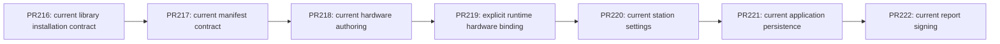

# Authoring without legacy application paths

## Goal

The application has not been deployed or used. Keep one current authoring design and current persisted manifest contract. Remove application backward-compatibility paths instead of maintaining old application data or parallel hardware creation designs. Preserve useful OpenTAP import, external package, runtime broker, containment, corruption, and save-failure behavior where it serves the current product.

The stack is:



## Area 1: current manifest contract — PR217

### Specification

`authoring.json` must use current manifest schema 2 for editing or saving. A lower version is rejected before creating a directory, temporary file, backup, package, or replacement. A future manifest can still load read-only; saving over its existing bytes is rejected. Saving a current request over an existing older manifest is also rejected.

The manifest nested inside `authoring-drafts/workspace.authoring.json` follows the same version contract. Unsupported older nested manifests are reported as recoverable, read-only source corruption; their bytes cannot be silently replaced. Future nested manifests remain read-only. Remove manifest migration, the `--migrate` command, schema-specific migration backups, and migration-based catalog comparison normalization.

The shared workspace, its manifest schema, manual compiled-workspace fixtures, and current test manifests use schema 2. Other document formats have independent current versions; run records currently use version 4. Do not renumber those formats as part of this area. Ordinary atomic-save backups remain.

### Pseudocode

```text
load manifest:
    parse required positive integer version
    if version < current: reject without writes
    if version > current: load read-only
    otherwise: validate current fields and load

save manifest:
    validate destination containment
    if destination exists:
        load existing manifest
        reject older or read-only future manifest
    require request.version == current
    create destination and atomically write current content

load nested workspace manifest:
    reject version < current as recoverable read-only source
    treat version > current as read-only
    otherwise permit current source edits

save nested workspace manifest:
    require request.version == current
    reject an existing read-only source
    use ordinary atomic writer and backup
```

### Tests

Replace migration-success cases with actual byte-preservation checks for older manifest load/save, saving over older existing bytes, and an invalid old request targeting an absent directory. Keep current-schema round trips, atomic replacement failure cleanup, future existing-manifest protection, nested-source recovery, and normal backup preservation.

Exercise removed `--migrate` as an invalid command for older/current/future files, preserving the files and creating no artifacts. Verify bootstrap, validation, pack, and compatibility commands reject an old manifest before writing. Verify an older nested manifest blocks export without being normalized into a current catalog.

Update current inline manifest fixtures and shared-template callers. Future-schema tests that replace the shared template's version literal must now replace 2 with 999 so they still exercise their intended protection.

### Risks and conflicts

Old developer fixtures will stop opening. Update maintained fixtures explicitly; do not add an automatic upgrade path. Do not blanket-replace schema 1 in unrelated documents. Version rejection must precede directory creation. Keep future existing-file protection even when the incoming request uses schema 2.

The shared `plans/opentap/authoring.json` fixture is copied by many core and UI tests; its version change affects future-schema replacement tests and manual review data. Run those tests alongside manifest tests. PR216 changes bootstrap tests and package handling, so keep this area based on the completed PR216 stack and limit bootstrap test changes to manifest literals.

## Area 2: current hardware authoring — PR218

### Specification

Remove old VISA DMM from the authoring catalog, New test plan hardware choices, binding creation, and old-VISA-specific authoring validation. Remove `WorkspaceCreationRequest.IncludeVisaPackage` and the host's authoring construct/serialize adapter helper. Rename the remaining built-in adapter collection to Demo, and rename `ProductVoltage` to `HardwareScaffold` without an alias. Physical library adapters expose generic identity and safe shutdown; voltage/mean recipes remain explicit Mock DMM demonstrations. Retain modern Instrument Components adapters and explicit Mock DMM demo support.

Remove unused VM `CreateProgram` convenience overloads. Production UI already uses durable `InitializePlan`; migrate test setup to that path with explicit instruments. Tests requiring unsaved changes should make a real edit after durable initialization.

Retain required runtime broker infrastructure. Remove authoring bootstrap's old VISA package installation route alongside its authoring adapter. The following runtime area removes the obsolete plugin; the modern bridge uses IVisaBroker directly and does not require VisaBrokerHost.

Remove the three unreviewed catalog deletion wrappers and their rejection helper. All deletion requests use Prepare/Review/Apply; retain blank-target diagnostics, protected catalog entries, durable source and stale-review guards.

Runtime bootstrap may return early only when the full declared OpenTAP runtime payload validates. Continue rejecting present invalid files before copying, allow missing declared files to be repaired, and permit unrelated partial external imports without a current-library requirement.

### Pseudocode

```text
hardware choices:
    discover validated current library adapters
    append explicit Mock DMM demo choice
    offer no old VISA DMM creation route

create plan:
    review explicit request
    initialize durable current authoring source
    present its normal document session

bootstrap authoring runtime:
    reject present invalid runtime payload
    return early only when full declared payload validates
    otherwise copy missing current runtime files
    install explicit Mock/current library packages; exclude old VISA authoring package

delete catalog entry:
    prepare current request -> review -> apply with source/staleness/protected guards
```

### Tests

Convert old-VISA authoring acceptance to unavailable-adapter coverage. Retain actual slot binding, no substitution, stable node identity, opaque source preservation, stale destructive-review detection, and cleanup retargeting tests using explicit Mock slots or modern library devices as appropriate.

Port payload completeness, symlink containment, cyclic-link, and ancestor-resolution coverage to current adapter/package fixtures instead of deleting those regressions. Keep runtime `VisaDmmInstrumentTests`, plan validation, and broker coverage until the separate runtime scope assessment establishes their replacement.

Update hardware UI fixtures in `AuthoringHardwareDefinitionTests`, `AuthoringGuidedRecoveryTests`, `AuthoringWorkspaceCreationUiTests`, `AuthoringPlanInitializationTests`, `AuthoringGuidedOnboardingTests`, and `AuthoringExpertCommandsTests`. Use Mock DMM for demo voltage/mean behavior and library hardware scaffolds for physical-device lifecycle behavior. Update both test projects' initialization helpers and direct callers of the removed VM conveniences. Preserve unsaved test semantics by making real edits after initialization. Port catalog deletion wrapper tests to reviewed requests. Add regression coverage that prepares a current Mock home, deletes a genuine declared runtime dependency, and verifies a second prepare repairs its bytes; retain unrelated no-library partial-import acceptance.

### Risks and conflicts

Modern library devices currently do not support the old authoring voltage/mean recipes. Removing the old physical DMM authoring path does not make the library equivalent; preserve explicit demo measurement coverage and accurately describe physical scaffold limitations.

Removing the authoring helper without addressing bootstrap's Type marker breaks compilation. Removing the entire VISA plugin at the same time would broaden this area into runtime behavior; assess that independently. Do not delete document/session dirty tracking merely because a comment describes compatibility: current saving, recovery, and history still use it.

PR218 must build on PR217's schema-2 fixtures. Keep shared initialization test-helper updates coordinated so current hardware regression coverage survives the removal of old convenience APIs.

## Area 3: explicit runtime hardware binding — PR219

### Specification and public surface

Remove the entire obsolete HardwareTest.OpenTap.Plugins.Visa project, VisaDmmInstrument, VisaBrokerHost, package metadata, project registrations and lockfile. Retain IVisaBroker, worker hardware ownership, the owned current Instrument Components execution library and InstrumentComponentsScpiIo provider, and the owned StandaloneVisa distribution boundary. Authoring searches use Basic and Mixins without obsolete DLL filters or no-Visa guards.

Replace includeVisaAdapter and ExcludeVisaAdapter with EnablePhysicalExecution (false by default), independent of plugin inclusion. Production OpenTapSession and worker execution explicitly enable it. Catalog, authoring, validation and demo searches default to false. Only enabled execution with a broker loads the owned execution library and registers its current provider; no broker means no execution-library/provider loading. Preserve approved-byte loading, provenance, all-root prevalidation and rejection before provider mutation. The published library parses its embedded model registry with reflection JSON; explicitly enable that runtime capability in the untrimmed worker and owned standalone execution processes and their execution fixtures. Application persistence retains source-generated contexts. Authoring and validation processes do not execute physical instruments.

Remove TryRebindDmmResource from station/session APIs, worker messages, implementations, fakes and approved public surfaces. TryBindSlotResource requires an existing named slot and its exact instrument; blank slot/resource or unknown slot returns false without mutation. Rename StationProfile.RoleToResource and its worker DTO to SlotToResource without an API or wire alias. ApplyStationAndDut and run snapshots match only exact current slot names (ordinal case-insensitive), never RoleHint, dmm or first instrument.

BuildStationProfile emits only explicit PlanSlotOverrides.SlotName entries. Existing registry storage removal belongs to PR220, but runtime cannot consult it. RoleHint remains display metadata. The debug overlay requires an explicitly selected existing slot beside the Resource input. Missing or unknown selection and blank resources produce actionable status before any step/resource mutation; preserve threshold, acquisition and enabled patch features.

### Pseudocode

```text
search(enablePhysicalExecution = false, broker):
    if enablePhysicalExecution and broker exists:
        prevalidate and load owned current library
    search Basic, Mixins and configured roots
    if enablePhysicalExecution and broker exists: bind current SCPI provider

bind(slotName, resource):
    reject blank name/resource
    find exact known slot and exact corresponding instrument
    reject absent slot/instrument without mutation
    set supported resource property and update only that slot

apply station:
    for each known slot:
        apply only SlotToResource[slot.Name]

debug patch:
    require selected existing slot and nonblank resource before mutations
    bind selected slot; apply existing enabled/acquire/threshold controls
```

### Tests

Use an actual two-Mock-instrument plan to verify a selected slot changes only its instrument, unknown/blank requests change neither, and a broad DMM role cannot override explicit resources. Verify worker DTO and dispatch parity and current protocol approvals. Cover debug selection errors before mutations and retained patch controls, and exact profile/snapshot behavior.

Port old DMM broker query/write, timeout clamping, disposal and invalid-resource coverage onto the genuine published library and current SCPI bridge. Physical plan validation uses a genuine current library instrument; retain Mock measurement validation. Keep cold owned execution loading, invalid root/prevalidation, worker broker ownership and StandaloneVisa boundaries. Use fake brokers only; never perform hardware I/O.

### Risks and conflicts

Runtime entrypoints must opt in explicitly so changing defaults does not disable production physical execution. Wire and public mapping names change together with no old aliases. Removing a plugin reference changes affected restore graphs; remove its lockfile and regenerate retained project locks through restore, never by manual fabrication. Settings registry and idle-hour cleanup are out of scope until PR220. Preserve the upstream TUI readiness classifier and owned-load contract unchanged.

## Area 4: current station settings and authoring surfaces — PR220

- Goal: current per-plan slot overrides and idle minutes are the sole station settings model; authoring and bench presentation expose only used current operations.
- Depends on: reviewed PR219.
- Out of scope: Area 5 persisted schema gates/run ledgers, Area 6 report signing, external OpenTAP interchange, broker execution.
- Files: AppSettings, SettingsStore, settings binder/provenance/copy/JSON metadata, station/operator/settings VMs, authoring workspace/catalog/initializer tests, LivePresentationViewModel, OperatorTouchDensity, BuildInfo and corresponding test projects.
- Public surface: remove Instruments/StationBindings/VisaInstrument/StationBinding, dormant global DefaultVisaResource and OperatorSessionIdleHours; retain PlanSlotOverrides, current minute normalization and editing-time MigrateSettings. Remove unused discovered aliases. Rename OpenTapPluginDirectoriesEnv to match HARDWARETEST_OPEN_TAP_PLUGIN_DIRECTORIES everywhere, with no old-name alias. NormalizeBooleanInput retains supported 1/yes/on syntax.
- Authoring surface: remove unused VM ApplyRecipe and catalog CreateProgram convenience APIs; keep catalog Apply factory, explicit AuthoringPlanInitializer and durable plan creation. FormulaSaveOutcomeKind exposes PacksChannelAverage only. Preserve direct MeanGte versus ChannelAverage semantics and AlgorithmSource uncertainty protection.
- Presentation surface: remove PresentationChromeMode, ToggleFocusTrendCommand, UserWantsFocus, ShowFocusTrend, ShowPlotForSelection, OfferShowTrend and old splitter sizing constant. Retain chart buffers, selection/cursor/time windows, HasChartData/HasChartAttention and shell FocusTrendTip. BuildInfo reads deterministic version+sha and CommitDate only.
- Pseudocode:
  ```text
  BuildStationProfile(selectedPlanId):
    if selectedPlanId blank -> no overrides
    choose only exact selected plan entries with nonblank exact SlotName
    bind resource by slot identity; no role guessing; missing override preserves resource
  settings load -> current defaults + file + environment + CLI overlays
    normalize OperatorSessionIdleMinutes; ignore removed fields; no disk upgrade
  InsertSelectedRecipe:
    select current recipe; validate insertion context and CanInsert
    execute current insertion (including EndOfSection semantics)
    assert inserted behavior; never use factory fallback after insertion rejection
  test MockDmm draft fixture -> explicit currentAuthoringPlanInitializer
    malformed/duplicate source tests may explicitly construct drafts
  RefreshChrome -> update current chart availability/attention only
  Reset -> clear active chart data/selection/cursor state
  BuildInfo -> parse sha metadata, read CommitDate; absent/invalid date -> unknown
  ```
- Tests: settings round trip/file/environment/CLI precedence, current minutes normalization, removed registry/hours ignored; exact plan/slot binding, blank plan/slot yields none, same-role slots retain independent resources. Port meaningful authoring tests to validated selected-recipe insertion with CanInsert assertions; explicit fixture initialization replaces hidden demo defaults. Port chrome tests to chart availability/reset/attention/navigation and density tests to retained sizing. BuildInfo covers current sha/date and missing date without invented timestamps.
- Risks: validated insertion can expose invalid old test setup; preserve its actual rejection/placement semantics. Defaults, provenance, copy, JSON metadata and all environment capture/host paths must change together. User function changes still transfer compatible settings normally.
- Conflict map: Area 3 station execution API is stable; Area 5 SettingsStore/schema changes must remain sequential. Authoring and presentation test ports are disjoint from station settings implementation; only this area owner stages/commits. No SDK, Deno, build, restore, test or format commands in child work; root freezes source HEAD and performs checks.

## Area 5: current application persistence — PR221

## Goal and stack

Application-owned persisted documents load only their explicit current schema, or the existing supported future read-only representation. Absent, zero, or older documents produce an actionable unsupported error and keep their original bytes. No conversion, schema stamping of old objects, legacy badge, singleton test-run PDF, alternate built-in template filename, or implicit ship-dependency list remains. Existing current report behavior, issued-artifact immutability, settings overlays and stable identity, current recording import checks, and atomic current-data recovery remain usable.

One ready stacked PR, based on the reviewed public head of PR220. PR222 physical signing bases on PR221's reviewed public head. Do not merge. Expand `docs/authoring-no-legacy-plan.md` before implementation using this specification. Its existing Area5 wording excludes ordinary backup machinery; the contract here explicitly requires current-only corrupted-primary backup recovery, so make that requirement precise without broadening authoring recovery scope.

Dependency graph: PR220 stable public head -> PR221 current persistence/artifacts -> PR222 physical signing. Within PR221 implement shared gate, then store guards/producers, then canonical report consumers, then fixtures and docs. These are implementation stages, not separate PRs.

## Exact consumers and changes

| Surface | Current consumers | Required change |
| --- | --- | --- |
| Shared schema | `Core/Serialization/DocumentSchemaGate.cs`, `SchemaUpgradeRegistry.cs`, `SchemaVersions.cs`, `AppJsonContext.cs` | Keep versions settings1/ui1/run4/suite1/crash1/station1. Enum Current/Unsupported/FutureReadOnly only. Delete registry and step type, IsLegacy and upgrade APIs/comments. Gate raw canonical `schemaVersion` before generated deserialization. |
| Settings/UI | `Core/Settings/SettingsStore.cs` LoadAsync and both Save methods; AppSettings/UiState generated context | Block unsupported/future existing destinations, do not normalize/persist a failed baseline, retain stable injected AppSettings identity, overlays/provenance, operator-visible error/warning. Clear stale blocked state on a successful current reload. |
| Runs | `Core/Runs/FileRunStore.cs` Load/List/Save; TestRunSummary and `TestRunModels.cs` runtime flags | Reject old documents, skip unsupported list entries with a diagnostic, preserve future read-only summary behavior, reject old objects and blocked destinations before mutation. Remove IsLegacy from DTO/index. |
| Suites | `Core/Runs/FileSuiteRunStore.cs` Load/Save and embedded PlanRuns | Gate suite header and embedded run headers; validate all child run objects/destinations before any child save. Preserve suite ReportPdfPath only. Remove suite IsLegacy. |
| Recording ingest | `Authoring.Core/RunDatasetCatalog.cs` Load/List/Import/ApplySchemaGate | Use shared raw gate and contextual AuthoringWorkspaceException. Keep sample/event array validation, finite values, expected plan identity, containment/link checks, copy-then-revalidate and atomic import publication. No implicit importer for old recordings. |
| Recording board event scope (audit finding) | `Authoring.Core/BoardPreview.cs` `EventsForGroup` returns every recording event to every publisher group when all event execution IDs are absent | Remove the identity-less all-events fallback. Per-execution preview overlays require matching StepRunId, or matching LoopRunId plus IterationIndex; never invent execution evidence from global marks, names, or paths. Port meaningful synthetic sample/event fixtures to explicit matching IDs and test isolation across executions. Unscoped marks remain available to intentionally global displays; external OpenTAP presentation-role defaults and AuthoringDocumentSession comparison are out of scope. |
| Retention (additional consumer) | `Core/Storage/RunRetentionService.cs` Analyze directly deserializes run/suite | Inspect headers before typed deserialization. Unsupported/future records must be skipped/protected, not reclassified through directory-time fallback and deleted. This is necessary to preserve bytes, not a retention redesign. |
| Crash | `Core/Crash/CrashDossierWriter.cs` Write/ListUnreviewed/TryWriteJson; `CrashModels.cs` default SchemaVersion=1 | Gate crash.json read before deserialization despite initializer. Validate writes and existing collision destination; no unconditional stamp of old context.Report. Preserve best-effort crash reporting. Current crash writes need atomic JSON publication, not File.Create truncation. Config snapshots are not schema-versioned application document families in this contract. |
| Station health | `Core/StationHealth/FileStationHealthStore.cs` TryRead/WriteAsync; `StationHealthRecorder.cs` | Gate raw read; log actionable rejection under existing fail-soft TryRead API. Validate existing destination even when caller passes a fresh current record. Currently no future guard exists: add it through shared guard rather than relying on DTO flags. Recorder already stamps current at creation. |
| Current producers | `Features/RunTest/RunExecutionViewModel.cs` two TestRunRecord constructions; TypstReportService.GenerateSuitePdfAsync aggregate; CrashDossierWriter.Build report creation; SettingsStore default factory; station recorder; suite callers/fixtures | Explicitly construct current records. Writers validate versions; they must not assign current over zero/old versions. In-memory preview-only MetricPreview record and serializer snapshots are not independent persistence ingest. |
| Triage/history | `Core/Runs/RunTriageSummary.cs`, `DutHistoryService.cs`, Results detail | Delete BuildLegacyLedgers, IsLegacyTriage, run.IsLegacy branching and legacy messages. Derive chronology only from StepAttempts. Keep LatestAttempt's compact latest-ledger support; never synthesize chronology from Steps. |
| Report generation | `Core/Reporting/TypstReportService.cs` GeneratePdf/GenerateReports/MergeGeneratedArtifacts/GenerateSuitePdf/CompileTemplateCore | Reports is sole test-run representation. Replace by explicit kind + working role, preserve all issued artifacts. GeneratePdf returns generated status artifact path. Suite retains singleton path. Preflight writeability before modifying PDFs/attestations, not only eventual run Save. |
| Report ownership/attestation | `Core/Credentials/ReportAttestationService.cs` ResolveWorkingPdfPath, RunOwnsPdf, plus callers of ResolvePdfPath/KindForPdf/ResolvePrintOrExportPdfPath | Remove singleton fallback and singleton ownership; resolve solely through explicit current artifacts. Preserve issued preference for print/export and existing signing behavior; physical implementation removal belongs to PR222. |
| Results | `Features/Results/ResultsViewModel.Detail.cs` LoadReportItems/default/reprint/legacy status; `.Export.cs` singleton file export; `ResultsView.axaml` legacy badge | Remove artifact reconstruction and legacy status/badge. Default open uses catalog default working kind, status working, then first working only. Issued-only list has no default working PDF; explicit issued open/export remains supported. Regeneration opens canonical current working selection. |
| Preview | `Features/ReportPreview/ReportPreviewViewModel.cs` LoadLatestAsync | Select current working default artifact using the same rules as Results; generate catalog kinds when none exists (or selected path is missing), resolve resulting default, preserve UI-thread dispatch and print routing. Do not regenerate a read-only run. |
| Templates/config/docs | `templates/reports/test-report.typ`, `status-report.typ`, certification + lib; Typst template resolution; AppSettings.ReportTemplateName; `docs/adapting.md` | Keep test-report.typ canonical and delete duplicate status-report.typ and alias fallback. Keep explicit custom filenames and DataDirectory/reports overrides; a requested missing template fails naming that template. AppSettings default already test-report.typ. Audit build/embed globs for deleted resource. |
| ShipManifest | `Authoring.Core/WorkspacePacker.cs` record/PackStaged; `WorkspacePackPlan.cs` TryReadShipManifest; `AuthoringBuildRequest.cs` result snapshot; `AuthoringBuildService.cs` receipt; AuthoringJsonContext | Nonnullable required Dependencies constructor argument, no default and no ResolvedDependencies. Empty dependencies serialize `[]`. Raw required-property check rejects missing/null/non-array before deserialize, and constructor rejects null for in-memory use. Preserve TryRead fail-soft null. Copy Dependencies into immutable result/receipt snapshots. |
| Test doubles | `ViewModels.Tests/Fakes/Fakes.cs` report merge, suite generation, run summaries | Remove singleton test-run and IsLegacy assignments; mimic actual kind/role merges so behavioral assertions remain meaningful. |

## Shared gate and IO pseudocode

```text
ReadHeader(rawBytes, documentType, currentVersion, path):
  parse JSON once; require object root
  canonical schemaVersion absent -> Unsupported (not initializer current)
  canonical schemaVersion must be Int32 integer JSON number
  explicit current -> Current
  zero/negative/older -> Unsupported
  explicit greater -> FutureReadOnly
  malformed JSON/shape/noninteger -> corruption/error, never current
  extract optional writer app version for diagnostic

ReadDocument(rawBytes, generatedTypeInfo):
  status = ReadHeader(...)
  if Unsupported: throw schema-specific exception with path,
    stored/missing version, supported current version and operator action
  deserialize current/future using existing generated context
  preserve actual stored version; attach future runtime state where API supports it
  never apply upgrade or manufacture current from defaults

GuardWrite(candidate, destination):
  require candidate.SchemaVersion == current
  reject candidate read-only state / stored future version
  if existing destination: inspect its raw header before touching candidate/files
    Unsupported/Future -> reject with original bytes unchanged
    malformed -> follow current corruption recovery policy, not schema conversion
  write atomic current bytes
```

Gate APIs should consume the same captured bytes eventually deserialized, avoiding a reopen between version check and load. Writers must inspect the destination, not only trust state on a loaded DTO; a new current object must not clobber an existing old/newer file. Serialize settings and run saves as needed to close load/save races within this process. A reload that finds a current replacement must reset read-only/unsupported warning flags and persistence errors. Unsupported settings can expose defaults and overlays for recovery UI, but they cannot become a saved normalized baseline. Preserve successful file/environment/CLI precedence and injected object identity.

Suites require raw header checks of every embedded PlanRuns element; typed child defaults must not manufacture current. Preflight entire suite and child destinations before writes. The contract does not require transactional multi-file suite IO beyond existing behavior, but version rejection must not partially rewrite children.

Observed gap: Core AtomicFile only creates a same-directory temporary file, flushes and rename-overwrites; it has no .bak maintenance/read recovery. Application SettingsStore/FileRunStore/FileSuiteRunStore/FileStationHealthStore do not recover backups. AuthoringDocumentStore .bak behavior is a separate system and should remain untouched. Implement a narrowly scoped current-document read/write helper or layer around AtomicFile for this contract:

```text
Read primary:
  valid Current -> return primary
  valid Unsupported/Future -> return rejection/read-only; do not consult backup
  corrupt primary -> inspect .bak captured bytes
    valid Current + valid typed document -> atomically restore primary and load
    old/future/malformed backup -> actionable failure, leave original bytes
Write validated current:
  preserve a valid current preimage as .bak atomically
  publish current primary via existing temp/flush/rename machinery
```

Do not introduce a generic backup writer for unrelated credential/time/authoring files. Determine backup policy for absent primary separately: recovering an existing valid current .bak is reasonable; absence is not an excuse to import an old .bak. Failed recovery must not trigger autosave of defaults. Settings save should keep its existing nonthrowing API and LastPersistenceError/IsSettingsWritable contract; run/suite writes use schema exceptions; station TryRead/list callers keep their fail-soft behavior while writes reject overwrite.

## Reports pseudocode and boundary risks

```text
merge(generated):
  keep every issued artifact
  keep other artifacts unless role == working AND kind in generated kinds
  append explicit kind/title/path/time/working artifacts
  persist run.Reports only

defaultWorking(run):
  prefer working artifact for ProgramCatalog default kind
  else working status
  else first working with a usable path
  else null

print/export(kind):
  explicit issued artifact for kind, else explicit working artifact
  no inferred singleton artifact and no certification-to-status fallback

triage(run):
  ledgers = run.StepAttempts
  firstFail from stored Attempts sorted completion/start, attempt number, step path
  latest per ledger from chronology, or compact LatestPassed/LatestMessage
  totals use current ledger counts
  empty ledger stays empty even if Steps contains failures
```

Currently IsWorking treats blank/null role as working and artifact Role initializer defaults working. The contract asks explicit current kind/role: convert maintained producers and fixtures to explicit roles, and avoid adding new compatibility interpretations. Do not accidentally delete legitimate compact latest-attempt ledgers. If strict role validation is added at persistence boundary, test that current explicit unknown roles are not silently replaced during generation; replace only working entries. Current MergeGeneratedArtifacts removes every non-issued matching kind, which is broader than the requested working-role match.

Typst compiles all requested kinds before mutation today; retain that useful failure behavior. Add schema/write preflight before invalidating attestations or writing PDFs so a rejected document does not leave changed report bytes. Preserve issued PDF and sidecar hashes across regeneration of a working kind. Suite generation currently creates/persists a TestRunRecord aggregate in the regular runs tree; ensure it is explicit current and leave existing suite storage semantics intact unless needed for correctness.

Custom kinds currently use selected ReportTemplateName; certification uses its built-in. Removing alternate filename fallback must not remove explicit custom `status-report.typ` when the user places that filename in DataDirectory/reports and explicitly selects it. It simply ceases to be an embedded alias/fallback. Requested missing custom/canonical filenames fail directly.

## Meaningful tests to port and add

1. `Tests/Serialization/SchemaVersioningTests.cs`: replace successful legacy/identity-upgrade tests with absent/zero/older rejection and before/after bytes; do not keep registry coverage. Keep future fixture load/read-only/writer diagnostic and current roundtrip. Run-v1 is older than current run4, so create explicit run4 functional fixture instead of renaming upgrade assertions.
2. Each document family: current roundtrip; absent/zero/older rejected; future read-only or fail-soft visibility plus rejected destination writes; original primary and backup bytes unchanged; fresh current candidate cannot overwrite unsupported/future destination. Include schemaVersion null/string/fractional, PascalCase-only header, object initializer masking in crash, and root-null/array failure. For run4 cover older1/2/3, and suite embedded child gates. No schema number reset.
3. SettingsStoreTests/ConfigurationBootstrapTests: stable AppSettings identity, provenance/file/environment/CLI order, normalization only after current load, unsupported defaults cannot autosave, UI-state blocked saves, unsupported/future primary never replaced by current backup, success reload clears flags. Port all hand-written successful settings/UI JSON to explicit current header without dropping overlay/normalization assertions.
4. FileRunStoreTests and suite coverage (new suite test file if necessary): current sample/event/attempt/report roundtrips; List omits unsupported while preserving current/future entries; suite child version failure occurs before any successful child rewrite. Current corrupted primary + current backup restored atomically; old/future backup not restored. Keep AtomicFile containment and temp-cleanup coverage where present; add focused backup/recovery tests.
5. StationHealthStoreTests/StationHealthHostTests/StationHealthGateTests: retain clock/source/metrics/age behavior; port zero-version constructions to current. Add raw header rejection and destination overwrite guards, corruption recovery, future station record handling. CrashReportingTests: current dossier summary/read, initializer cannot hide missing header, future/old dossier safe listing, current atomic write and collision guard with best-effort crash behavior.
6. RunRetentionService tests (add focused tests if absent): unsupported/future run and suite folders are preserved even when timestamp/size policies would otherwise delete them; valid current retention still prunes eligible completed records. This tests destructive consumer safety rather than only gate helper behavior.
7. RunDatasetTests + recording/import/source-swap tests: retain mean VDC=2, missing channel, missing limits, elapsed transfer-function behavior, no-DUT serial, extra metric keys, future read-only, finite value/identity rejection and source replacement isolation. `tests/fixtures/authoring/recordings/sample/mean-vdc/run.json` and `tf/vdc-elapsed/run.json` are schema3 today: port to schema4 and current attempts where functional behavior requires them. Old fixtures remain only as intentional rejection inputs.
8. RunTriageSummaryTests: keep chronology-vs-path ordering, retries first fail, all pass. Port fallback functional case to explicit StepAttempts; add empty StepAttempts with failing Steps -> no inferred first fail/count; incomplete and compact latest-ledger totals remain correct. DutHistoryServiceTests + Results first-fail tests: explicit current ledgers, retain metric comparability/identity/history assertions, remove legacy messages.
9. TypstReportServiceTests: port ReportPdfPath assertions to explicit status working artifact; retain sample chart compile, DataDirectory override, multiple kinds, compile identity snapshot isolation, invalidation and issued immutability. Add explicit custom name, missing requested name error, no alias built-in, partial kind generation preserves unrelated working/issued artifacts, default working ordering, and rejected read-only generation leaves PDFs/attestations unchanged.
10. OperatorCredentialTests (singleton setup around current line588), ReportAttestationStampTests and ownership helpers: explicit working artifacts; certification has no status fallback; run ownership exclusively Reports; issued print/export canonical behavior and persisted attestation work as before. Do not remove physical signing assertions in this PR.
11. ResultsViewModelTests (singleton around line722), ReportPreviewUiThreadTests, Fakes: preserve selection-versus-open, catalog default, working versus issued preference, canonical issued export, report list both roles, regeneration, empty report UI, missing file generation and dispatcher guarantees. Add issued-only default -> null and explicit custom-kind defaults. Export carries report artifacts without singleton fallback and retains duplicate-path handling.
12. WorkspacePackPlanTests: change missing Dependencies success test to fail-soft null; explicit [] and populated arrays serialize and roundtrip; missing/null/non-array fail without editing manifest; malformed JSON fail-soft remains. WorkspacePackerTests use Dependencies. AuthoringBuildSnapshotTests/BoundaryTests/IdentityTests retain captured-source and immutable receipt/result dependencies; mutate caller-owned dependency list after result creation to prove copied snapshot isolation. Every constructor supplies an explicit list.

Root exclusively runs appropriate SDK build/test/format after source freeze. Suggested affected validation sets: HardwareTest.Tests (serialization/settings/runs/reporting/crash/station/credentials/storage), HardwareTest.ViewModels.Tests (Results/preview/RunExecution and settings fixture ports), HardwareTest.Authoring.Tests (recordings/pack/build); broaden only for actual failures or new affected projects. Existing external OpenTAP progress/summary fixtures are supported runtime inputs, not app document schema migrations.

## Conflict map and review handoff

Do not implement until PR220 is reviewed and its public head is fixed: SettingsStore, AppSettings schema/normalization fixtures, Results and authoring test fakes overlap. PR222 must wait on canonical Reports and attestation helper signatures. Authoring current manifest/document recovery contracts are stable and out of scope; ship-manifest is a separate output contract. No source/build/test/format actions in the frozen verification worktree.

After implementation: publish ready PR221 targeting PR220 branch with expanded spec, stack position and out-of-scope statement. Independent fork:none whole-area reviewer receives only this contract, base/head, changed files/diff instructions, and Must/Should/Nit criteria. Fix every Must/Should, republish, and spawn a fresh whole-area review until clean. Keep reviewer nits for root's end-of-chain summary. No merges.


## Area 6: current report signing — PR222

- Goal: one physical signing implementation: PKCS#11 with complete-PDF iText PAdES. PC/SC provides card presence and public identity; Mock credentials retain intentional HMAC sidecars. Presence-only attestation follows the current site policy.
- Depends on: PR221's canonical report artifacts.
- Out of scope: instrument VISA, credential features, hardware/card I/O and external OpenTAP interchange.
- Files: credential brokers/binding APIs, ReportAttestationService, obsolete PIV CMS/APDU signing and custom PdfPadesSignature helpers, credential/report tests and fixtures.
- Public surface: remove alternative physical APDU signing and non-embedded physical CMS/sidecar fallback. Simplify document-signing APIs after converting callers. Keep CredentialSignBinding.SerialsMatch for Mock identity checks and retain current PC/SC identity capture.
- Pseudocode:
  ```text
  physical issuance -> match badge identity -> PKCS#11 sign complete PDF
                   -> verify embedded iText signature -> publish issued artifact
  Mock issuance -> current HMAC sidecar -> verify current Mock signature
  presence-only policy -> current presence evidence; no invented signature
  verify physical PDF -> embedded iText verification only
  failed/cancelled signing -> preserve working and existing issued artifacts
  ```
- Tests: port meaningful old signer/parser coverage to current PKCS#11/iText. Preserve identity matching, PIN/retry handling, cancellation, signing failures, tampering, issued-artifact protection, Mock verification and presence policy. Use fake brokers or test certificates; never access a physical card.
- Risks: obsolete physical-sidecar verification still calls PivSigner.Verify; remove that acceptance deliberately before deleting its helper. Move minimal PDF fixture generation into test code instead of keeping the production parser. Retain PC/SC presence, current embedded verification and Mock functionality.
- Conflicts: follows PR221's report selection/attestation callers; implement sequentially and independently review the whole credential boundary.
