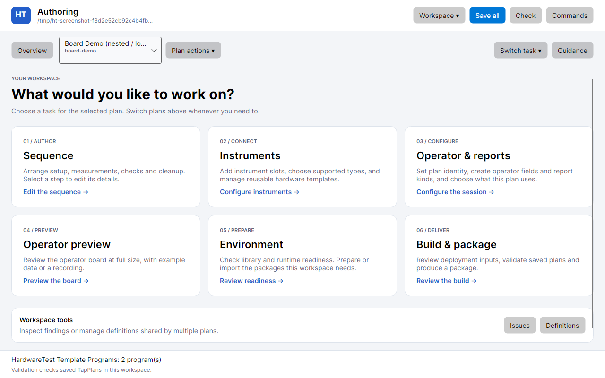
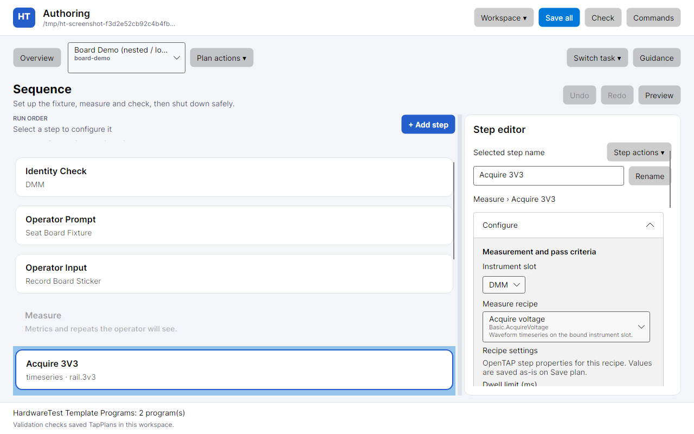

# Task-based Avalonia authoring workspace

This branch implements the task-based design in the real authoring application. `proposal.html` remains an offline, in-memory reference prototype; the Avalonia application uses the existing workspace model, save/compile operations, hardware catalog, recording import and guarded review dialogs.

## Implemented workflow

Opening a workspace lands on six task cards. A compact plan selector and Plan actions replace the permanent program rail. Overview and Switch task provide navigation without a visible tab strip. Issues and workspace definitions remain reachable through workspace tools and the task menu.

- **Sequence:** a broad, sectioned Setup / Measure / Cleanup canvas and a resizable step editor. Add step opens a searchable recipe list with explicit insertion choices and prerequisites. Rename is beside the name field; duplicate, move and removal live in the selected step's actions. Existing repeat, raw-source, formula, input, prompt and cleanup editors are retained.
- **Instruments:** real program bindings, supported wrapper types, typed configuration and reviewed edits. Reusable hardware templates are linked directly from the task. Plan classification and lifecycle settings use progressive disclosure.
- **Operator & reports:** plan identity, contextual creation of operator fields and report kinds, explicit plan membership, and the default report. Add operator prompt opens the sequence palette with the prompt recipe and end-of-Setup insertion selected.
- **Operator preview:** a full workspace, reached directly from Sequence. Data controls and recording selection are siblings of the board viewport. Charts allow wheel scrolling by default; Interact with chart opts into plot input. Charts reserve room for tile labels and controls when the viewport is short.
- **Environment:** separate library and execution readiness, a three-step preparation path, structured package/version/state rows, and collapsed runtime, recovery and declaration details.
- **Build & package:** existing build inputs, save guards, compatibility checks, output selection and receipts.

Guidance is a temporary side sheet with one scroll viewport and a fixed close action. Escape closes it, keyboard navigation stays within the sheet, and closing restores focus. Inspector expanders have internal padding.

## State and compatibility

Task switches retain page controls, selection, incomplete draft values and focus/scroll state. Changing workspace or plan clears obsolete focus targets. The step palette closes if its initiating workspace, plan or selected node changes. Existing owner/session guards, catalog-versus-plan scope, destructive review, source preservation and compilation/build rules remain authoritative.

The page host retains the existing logical route indexes for command and finding navigation; it renders only the active page and exposes a workspace pane to accessibility tools. Operator & reports and Overview add two destinations. The inspector width is retained for the current session, clamped to the available window width, and restored by Reset saved layout. Preview always uses its own page; legacy rail/dock preference values remain preserved for compatibility but do not affect this shell.

`AuthoringInstrumentCatalog.Discover` supplies the actual installed compatible library types. The bundled library exposes eight physical wrappers, plus the explicit Mock DMM choice. This enumeration does not imply that all wrappers implement the Basic voltage recipes. Missing or incompatible library payloads remain visible readiness failures.

The desktop minimum remains **960 × 600**. At that size the sequence and inspector remain adjacent and independently usable with enlarged text. The HTML reference also demonstrates narrower browser layouts; those are not desktop window sizes.

## Review screenshots

These are actual Avalonia frames rendered with Skia, using demo plans and example data.

Additional views: [960 × 600 with large text](avalonia-sequence-small.png), [step palette](avalonia-palette.png), [Environment](avalonia-environment.png), [Operator & reports](avalonia-operator.png), [full preview](avalonia-preview.png), and [dark theme](avalonia-sequence-dark.png).

The original `overview.png`, `sequence.png`, `sequence-small.png` and `environment.png` depict the HTML reference prototype.

## Review walk-through

1. Open a workspace and enter Sequence from Overview. Select a prompt, acquisition, calculation or repeat; resize its editor.
2. Add a step using search and an insertion choice. Edit its name and settings, then inspect Step actions.
3. Open Operator & reports. Add a field or report kind and explicitly include it in the plan. Try Add operator prompt.
4. Open Instruments. Inspect the available types and follow the links to Environment or reusable templates. Review an existing binding change.
5. Open full Preview and scroll over a chart. Enable Interact with chart when plot navigation is wanted.
6. Open Guidance, use its actions, and close with Escape. Switch plans and tasks to check draft retention.
7. Save, validate and review the build using the existing operations.

## Validation

- Release authoring/UI build: zero warnings or errors.
- Targeted library catalog, resource round-trip and editor-creation tests: 6 passed.
- Full authoring UI suite: **407 passed**, including task navigation, draft/file preservation, palette ownership, catalog scope, reviewed deletion, environment/build operations, recordings and responsive layouts at 960 × 600 and 1280 × 800, with font size 20 and 1.5 scaling.
- Actual Skia frames inspected in light/dark themes and at the minimum size; `git diff --check` passed.

Native Windows rendering, screen-reader behavior and physical hardware operation need platform review. No hardware I/O was performed during this implementation.
