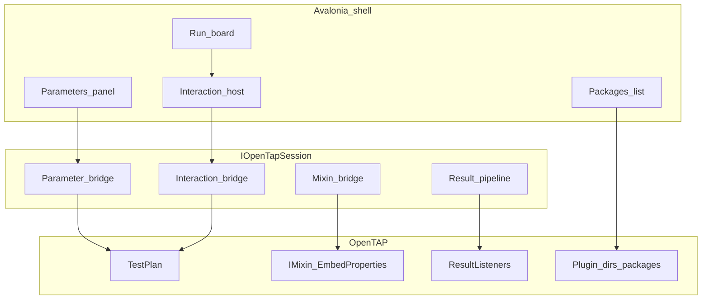

# OpenTAP platform (shell integration)

North-star for deepening OpenTAP integration in this Avalonia hardware-test template **without** cloning OpenTAP Editor or showing floating dialogs on sealed appliances.

Related: [adapting.md](adapting.md) (productize), [testing.md](testing.md) (UI vs host tests), [appliance-linux.md](appliance-linux.md) (publish layout).

**Sibling track:** [platform-roadmap.md](platform-roadmap.md) covers the non-OpenTAP hardening work (repo gates, configuration, diagnostics, crash capture, containerized CI, code structure, operator UX). OpenTAP phases use **letters (A–K)**; platform phases use **numbers (1–15)** — "Phase C" and "Phase 3" are never the same thing.

## Locked product decisions

| Topic | Decision |
| --- | --- |
| Packages | In-app **list** of installed packages + plugin dirs; install/update is **offline** (CLI / image bake). No feed browser. |
| Multi-DUT / Parallel | **Near-term — [Phase K](opentap-phases/phase-k-multi-dut-parallel.md).** K.1 = multiple operator DUT sessions, one plan at a time. Parallel plan execution is K.2. Depends on platform [Phase 14](platform-phases/phase-14-session-facade-split.md). |
| Dialogs / inputs / parameters | **Avalonia owns** all operator UI. No OpenTAP floating windows or OS modals on the bench. |
| Mixins | In scope — load, inspect, edit mixin-backed settings; custom mixins for complex cases. |
| Delivery | Architecture doc (this file) + [incremental phase plans](opentap-phases/) — implement one phase per PR series. |

## What the shell owns vs OpenTAP

| Avalonia shell + Host | OpenTAP engine |
| --- | --- |
| Run board, Inspect, Instruments, Results, reports | `TestPlan` execute, verdicts, plugins |
| Operator Session (DUT confirm, stale) | Instruments / DUT resources in the plan |
| Station overlays (slot + future parameter overrides) | Golden `.TapPlan` files (Editor-authored) |
| Structured operator interactions (in-panel) | Steps that *request* interactions via Host bridge |
| Typst PDF + optional result file export | `ResultListener` / `Results.Publish` |

UI talks to OpenTAP only through the focused session surfaces split out in [Phase 14](platform-phases/phase-14-session-facade-split.md) — `IOpenTapPlanSession` / `IOpenTapRunSession` / `IOpenTapStationSession` / `IOpenTapHostCatalog` in [`IOpenTapSessionSurfaces.cs`](../src/HardwareTest.OpenTap.Host/IOpenTapSessionSurfaces.cs), all implemented by [`OpenTapSession`](../src/HardwareTest.OpenTap.Host/OpenTapSession.cs). The aggregating `IOpenTapSession` is reserved for Composition and Phase 8 contract tests; an architecture test forbids it in Features. Typst reports: programs declare `reportKinds` (`status` / `certification`); see [adapting.md](adapting.md#reports-multi-pdf).

## Interaction contract (Avalonia-owned)

Types live in [`OperatorInteraction.cs`](../src/HardwareTest.OpenTap.Plugins.Basic/OperatorInteraction.cs) (plugin assembly, shared with Host). Bridge: [`StepRuntime.RequestInteraction`](../src/HardwareTest.OpenTap.Plugins.Basic/StepRuntime.cs).

Today: [`OperatorPromptStep`](../src/HardwareTest.OpenTap.Plugins.Basic/Steps.cs) (confirm-only) and [`OperatorInputStep`](../src/HardwareTest.OpenTap.Plugins.Basic/Steps.cs) (string/number fields) call `StepRuntime.RequestInteraction` / `RequestOperatorAttention` → Host `HandleInteraction` pauses → Run board **in-panel** host (title, message, fields) → Continue builds `OperatorInteractionResponse` → `Resume(response)`.

Flow:

1. Step emits `OperatorInteractionRequest` (title, message, fields: string/number/bool, optional validation).
2. Host pauses the plan thread (interaction gate + pause gate).
3. Avalonia Run board renders an **in-panel** interaction host (not a `Window`).
4. Operator Continue → `OperatorInteractionResponse` → Host resumes; values available to the step/session.
5. Cancel/abort maps to existing safety stop (`Response.Cancelled`).

**Forbidden on appliance:** OpenTAP `DialogStep`, WinForms/WPF message boxes, or any second top-level window for operator flow.

Pre-run parameter edits and mid-run inputs share the **same field control types** (`InteractionFieldViewModel`).

**Authoring:** Prefer `OperatorInputStep` (or custom steps calling `StepRuntime.RequestInteraction`) for technician input. Keep `OperatorPromptStep` for confirm-only pauses. Do not add OpenTAP Dialog steps to appliance plans.

**In-repo demos:** `SampleProgramFactory`, `BoardDemoProgramFactory`, and `SweepDemoProgramFactory` (loop iteration chrome) — see the table in [adapting.md](adapting.md#1-programs-tapplans--catalog).

## Parameter model

Two different concepts (do not conflate):

| Lane | Who | UI | Persistence |
| --- | --- | --- | --- |
| **Operator prompts** | Technician | Mid-run orange Run-board interaction host (`OperatorInputStep` / `RequestInteraction`) | Run results / step parameters — **not** `PlanParameterOverrides` |
| **Station overrides** | Engineer/Debug | Run board **Station overrides** panel (selected step) | `PlanParameterOverrides` in settings.json |

- Enumerate station-overridable members via TypeData (`EnumerateParameters` default listing = `StationOverrides`). Prompt-schema authoring on `OperatorInputStep` / `OperatorPromptStep` (Message, field labels, …) is `OperatorPromptSchema` and is excluded from the override panel.
- Member keys: `{stepId}/{MemberName}` (plan-level: `plan/{MemberName}`). Sample Acquire/Mean steps use stable Ids so overrides survive reloads.
- Golden `.TapPlan` files are not rewritten. Prefer the parameter bridge over growing sample-specific `TrySetAcquire*` / `TrySetMeanGte*` APIs (those remain as thin adapters).
- Shared control widgets (`InteractionFieldViewModel`) — separate collections / roles.

## Mixin support model

- Mixins load with plugins (`OpenTapPluginDirectories` / package install dirs). Host always searches Basic + Mixins plugin assembly directories (`OpenTapPluginSearch`).
- Demo: [`AnnotationMixin`](../src/HardwareTest.OpenTap.Plugins.Mixins/AnnotationMixin.cs) and [`PresentationMixin`](../src/HardwareTest.OpenTap.Plugins.Mixins/PresentationMixin.cs) (`ChannelKey` / `DisplayRole` / `YUnit`). Sample Identity Check attaches Annotation; Acquire/Mean steps across Sample, Board, and Sweep demos attach Presentation — see [phase-i-presentation-contract.md](opentap-phases/phase-i-presentation-contract.md). Run/Results map roles to plot + gauges ([phase-j-presentation-ui.md](opentap-phases/phase-j-presentation-ui.md)). Production plans attach mixins in **OpenTAP Editor**.
- Engineer/Debug Station overrides lists mixin-embedded members via TypeData (`EmbedProperties`), with `OpenTapParameterInfo.IsMixinEmbedded` + Group (e.g. `Annotation: Note`). Get/set uses the Phase C parameter bridge.
- Author mixins with `IMixin` + `IMixinBuilder` (`[MixinBuilder(typeof(ITestStep))]`). Avalonia does **not** offer “Add Mixin” — attach in Editor, edit values in the shell.
- See [phase-d-mixins.md](opentap-phases/phase-d-mixins.md) and [adapting.md](adapting.md#11-custom-mixins).

## Packages (list-only)

- **Settings → OpenTAP packages & plugins** lists installed packages (from local `package.xml`) and configured plugin search directories (Basic, Mixins, `OpenTapPluginDirectories`, `HARDWARETEST_OPENTAP_PLUGIN_DIRS`, `PluginManager`).
- Actions: refresh, copy path, open folder — **no** install from feed in-app.
- Provisioning: `tap package install` or bake `.TapPackage` into the appliance image, then Refresh; see [appliance-linux.md](appliance-linux.md).
- Host API: `IOpenTapSession.ListInstalledPackages` / `ListPluginDirectories` ([`OpenTapPackageCatalog`](../src/HardwareTest.OpenTap.Host/OpenTapPackageCatalog.cs)).

## Resources / VisaAddress

- Avalonia **Instruments** page owns discovery + per-plan `PlanSlotOverrides`; no OpenTAP resource manager window.
- Device column has two sections: **VISA** (IVI Find / mock) and **OpenTAP** (`IDeviceDiscovery` for `VisaAddress` via [`OpenTapDeviceDiscovery`](../src/HardwareTest.OpenTap.Host/OpenTapDeviceDiscovery.cs)). Apply uses whichever list is selected. Rows show parsed interface hints; **Query *IDN?** is opt-in confirmation (opens the resource briefly).
- Host bind order: **`VisaAddress` → `ResourceName` → `Address`** ([`InstrumentResourceAccess`](../src/HardwareTest.OpenTap.Host/InstrumentResourceAccess.cs)). Sample `MockDmmInstrument` exposes both `VisaAddress` and `ResourceName` on one backing field.
- Host does **not** Open/Close instruments around runs — OpenTAP opens them during plan execution (avoids double-open).
- Full ComponentSettings / bench-profile editor remains deferred ([deferred-bench-profile-ui.md](deferred/deferred-bench-profile-ui.md)); SCPI adopter path: [adapting.md](adapting.md#3-station-bindings-instruments).

## Sweep / loop progress

- Run hero shows innermost Repeat/Sweep iteration as `iter i/N` when the listener detects a known loop step (`RepeatStep`, `RepeatLoopStep`, `SweepLoop*`, `SweepParameter*`).
- Sweep bounds stay in OpenTAP Editor / Phase C station overrides — Avalonia does not edit sweep tables.
- Nested loops: only the innermost active loop is shown.

## Deferred (detailed plans — do not implement yet)

Longer-horizon OpenTAP / product work. Prefer the detailed plans under [`docs/deferred/`](deferred/) over one-line bullets.

| Plan | Topic |
| --- | --- |
| [Package feed install](deferred/deferred-package-feed-install.md) | In-app OpenTAP feed install/update (today list-only) |
| [Bench profile UI](deferred/deferred-bench-profile-ui.md) | Full ComponentSettings / bench-profile editor |
| — | Native OpenTAP dialog windows (**forbidden** on appliance; do not schedule) |
| — | Remote Agent / REST execution (out of shell scope for now) |

Multi-DUT / parallel is **no longer deferred** — see Phase K below.

## Phase checklist

| Phase | Plan | Status |
| --- | --- | --- |
| A | [Interaction contract skeleton](opentap-phases/phase-a-interaction-contract.md) | Done (API + host/Fake bridge) |
| B | [Avalonia interaction host + input steps](opentap-phases/phase-b-interaction-host.md) | Done |
| C | [Parameters panel](opentap-phases/phase-c-parameters.md) | Done |
| D | [Mixin support](opentap-phases/phase-d-mixins.md) | Done |
| E | [Packages list](opentap-phases/phase-e-packages-list.md) | Done |
| F | [Resource / VisaAddress alignment](opentap-phases/phase-f-resources.md) | Done |
| G | [Sweep / loop progress](opentap-phases/phase-g-sweeps.md) | Done |
| H | [Result export](opentap-phases/phase-h-results-export.md) | Done |
| I | [Presentation contract](opentap-phases/phase-i-presentation-contract.md) | Done |
| J | [Presentation UI](opentap-phases/phase-j-presentation-ui.md) | Done |
| K | [Multi-DUT / parallel](opentap-phases/phase-k-multi-dut-parallel.md) | Planned (after platform Phase 14) |

**Suggested order:** A → B → C → D; E can parallelize after the doc; F after C; G/H after parameters stabilize; I → J after loop-stamped samples / DUT history. **K after** platform [Phase 14](platform-phases/phase-14-session-facade-split.md).

## Cross-cutting rules (every phase)

- Extend `IOpenTapSession` carefully; keep Fake + `OpenTapSerial` host tests in sync. Prefer façade split (platform Phase 14) over growing the god interface further.
- Appliance/headless: **zero** new Window/dialog dependencies for operator flow.
- Update [testing.md](testing.md) when adding interaction/parameter cassettes.
- Check off the phase row in this doc when the incremental plan ships.
