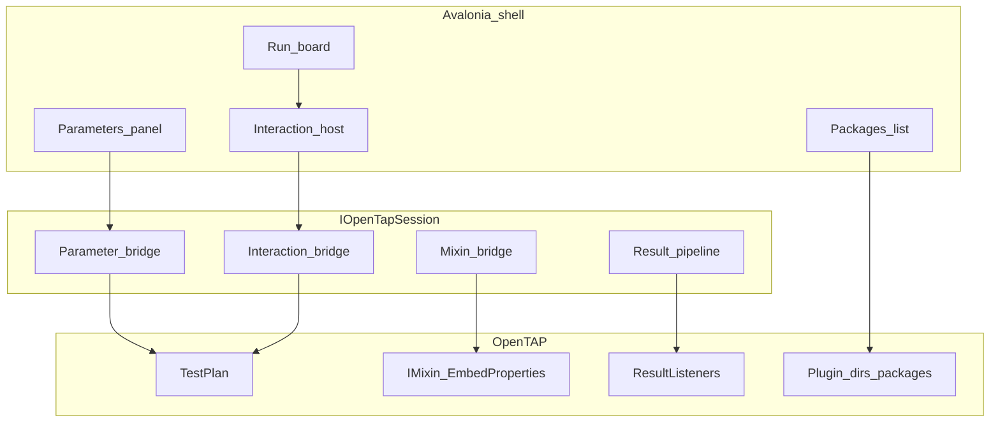

# OpenTAP platform (shell integration)

North-star for deepening OpenTAP integration in this Avalonia hardware-test template **without** cloning OpenTAP Editor or showing floating dialogs on sealed appliances.

Related: [adapting.md](adapting.md) (productize), [testing.md](testing.md) (UI vs host tests), [appliance-linux.md](appliance-linux.md) (publish layout).

## Locked product decisions

| Topic | Decision |
| --- | --- |
| Packages | In-app **list** of installed packages + plugin dirs; install/update is **offline** (CLI / image bake). No feed browser. |
| Multi-DUT / Parallel | **Deferred** — document only; single DUT + single plan for now. |
| Dialogs / inputs / parameters | **Avalonia owns** all operator UI. No OpenTAP floating windows or OS modals on the bench. |
| Mixins | In scope — load, inspect, edit mixin-backed settings; custom mixins for complex cases. |
| Delivery | Architecture doc (this file) + [incremental phase plans](opentap-phases/) — implement one phase per PR series. |

## What the shell owns vs OpenTAP

| Avalonia shell + Host | OpenTAP engine |
| --- | --- |
| Run board, Inspect, Instruments, Results, reports | `TestPlan` execute, verdicts, plugins |
| Operator Session (DUT confirm, stale) | Instruments / DUT resources in the plan |
| Station overlays (slot + future parameter overrides) | Golden `.TapPlan` files (Editor-authored) |
| Structured operator interactions (in-panel) | Steps that *request* interactions via Host bridge |
| Typst PDF + optional result file export | `ResultListener` / `Results.Publish` |

UI talks to OpenTAP only through [`IOpenTapSession`](../src/HardwareTest.OpenTap.Host/OpenTapSession.cs).

## Interaction contract (Avalonia-owned)

Types live in [`OperatorInteraction.cs`](../src/HardwareTest.OpenTap.Plugins.Basic/OperatorInteraction.cs) (plugin assembly, shared with Host). Bridge: [`StepRuntime.RequestInteraction`](../src/HardwareTest.OpenTap.Plugins.Basic/StepRuntime.cs).

Today: [`OperatorPromptStep`](../src/HardwareTest.OpenTap.Plugins.Basic/Steps.cs) (confirm-only) and [`OperatorInputStep`](../src/HardwareTest.OpenTap.Plugins.Basic/Steps.cs) (string/number fields) call `StepRuntime.RequestInteraction` / `RequestOperatorAttention` → Host `HandleInteraction` pauses → Run board **in-panel** host (title, message, fields) → Continue builds `OperatorInteractionResponse` → `Resume(response)`.

Flow:

1. Step emits `OperatorInteractionRequest` (title, message, fields: string/number/bool, optional validation).
2. Host pauses the plan thread (interaction gate + pause gate).
3. Avalonia Run board renders an **in-panel** interaction host (not a `Window`).
4. Operator Continue → `OperatorInteractionResponse` → Host resumes; values available to the step/session.
5. Cancel/abort maps to existing safety stop (`Response.Cancelled`).

**Forbidden on appliance:** OpenTAP `DialogStep`, WinForms/WPF message boxes, or any second top-level window for operator flow.

Pre-run parameter edits and mid-run inputs share the **same field control types** (`InteractionFieldViewModel`).

**Authoring:** Prefer `OperatorInputStep` (or custom steps calling `StepRuntime.RequestInteraction`) for technician input. Keep `OperatorPromptStep` for confirm-only pauses. Do not add OpenTAP Dialog steps to appliance plans.

**In-repo demos:** `SampleProgramFactory` and `BoardDemoProgramFactory` each include confirm + typed prompts and overridable Acquire/Mean settings — see the table in [adapting.md](adapting.md#1-programs-tapplans--catalog).

## Parameter model

Two different concepts (do not conflate):

| Lane | Who | UI | Persistence |
| --- | --- | --- | --- |
| **Operator prompts** | Technician | Mid-run orange Run-board interaction host (`OperatorInputStep` / `RequestInteraction`) | Run results / step parameters — **not** `PlanParameterOverrides` |
| **Station overrides** | Engineer/Debug | Run board **Station overrides** panel (selected step) | `PlanParameterOverrides` in settings.json |

- Enumerate station-overridable members via TypeData (`EnumerateParameters` default listing = `StationOverrides`). Prompt-schema authoring on `OperatorInputStep` / `OperatorPromptStep` (Message, field labels, …) is `OperatorPromptSchema` and is excluded from the override panel.
- Member keys: `{stepId}/{MemberName}` (plan-level: `plan/{MemberName}`). Sample Acquire/Mean steps use stable Ids so overrides survive reloads.
- Golden `.TapPlan` files are not rewritten. Prefer the parameter bridge over growing sample-specific `TrySetAcquire*` / `TrySetMeanGte*` APIs (those remain as thin adapters).
- Shared control widgets (`InteractionFieldViewModel`) — separate collections / roles.

## Mixin support model

- Mixins load with plugins (`OpenTapPluginDirectories` / package install dirs). Host always searches Basic + Mixins plugin assembly directories (`OpenTapPluginSearch`).
- Demo: [`AnnotationMixin`](../src/HardwareTest.OpenTap.Plugins.Mixins/AnnotationMixin.cs) / [`AnnotationMixinBuilder`](../src/HardwareTest.OpenTap.Plugins.Mixins/AnnotationMixinBuilder.cs). Sample Identity Check attaches Annotation in-code for a self-contained demo; production plans attach mixins in **OpenTAP Editor**.
- Engineer/Debug Station overrides lists mixin-embedded members via TypeData (`EmbedProperties`), with `OpenTapParameterInfo.IsMixinEmbedded` + Group (e.g. `Annotation: Note`). Get/set uses the Phase C parameter bridge.
- Author mixins with `IMixin` + `IMixinBuilder` (`[MixinBuilder(typeof(ITestStep))]`). Avalonia does **not** offer “Add Mixin” — attach in Editor, edit values in the shell.
- See [phase-d-mixins.md](opentap-phases/phase-d-mixins.md) and [adapting.md](adapting.md#10-custom-mixins).

## Packages (list-only)

- UI lists installed OpenTAP packages (package metadata / install folder) and configured plugin search directories.
- Actions: refresh, reveal/copy path — **no** install from feed in-app.
- Provisioning: `tap package install` or bake `.TapPackage` into the appliance image, then the list reflects them.

## Deferred (do not implement yet)

- Parallel steps / multi-DUT.
- In-app package feed install/update.
- Native OpenTAP dialog windows.
- Remote Agent / REST execution.
- Full ComponentSettings editor clone.

## Phase checklist

| Phase | Plan | Status |
| --- | --- | --- |
| A | [Interaction contract skeleton](opentap-phases/phase-a-interaction-contract.md) | Done (API + host/Fake bridge) |
| B | [Avalonia interaction host + input steps](opentap-phases/phase-b-interaction-host.md) | Done |
| C | [Parameters panel](opentap-phases/phase-c-parameters.md) | Done |
| D | [Mixin support](opentap-phases/phase-d-mixins.md) | Done |
| E | [Packages list](opentap-phases/phase-e-packages-list.md) | Planned |
| F | [Resource / VisaAddress alignment](opentap-phases/phase-f-resources.md) | Planned |
| G | [Sweep / loop progress](opentap-phases/phase-g-sweeps.md) | Planned |
| H | [Result export](opentap-phases/phase-h-results-export.md) | Planned |

**Suggested order:** A → B → C → D; E can parallelize after the doc; F after C; G/H after parameters stabilize.

## Cross-cutting rules (every phase)

- Extend `IOpenTapSession` carefully; keep Fake + `OpenTapSerial` host tests in sync.
- Appliance/headless: **zero** new Window/dialog dependencies for operator flow.
- Update [testing.md](testing.md) when adding interaction/parameter cassettes.
- Check off the phase row in this doc when the incremental plan ships.
